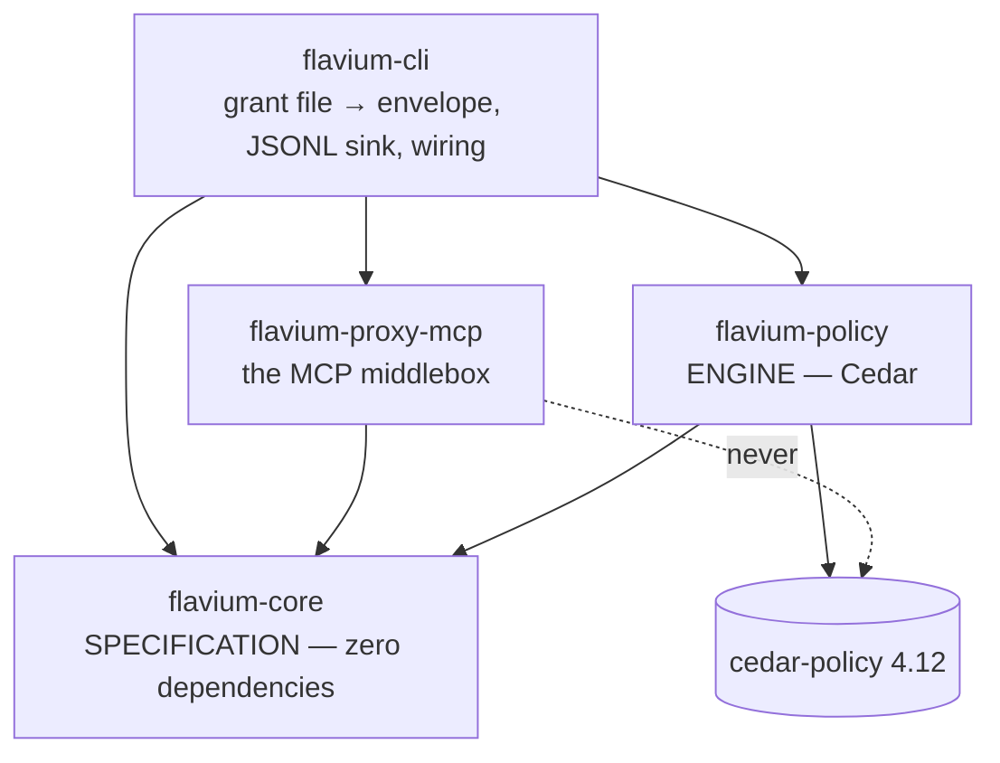
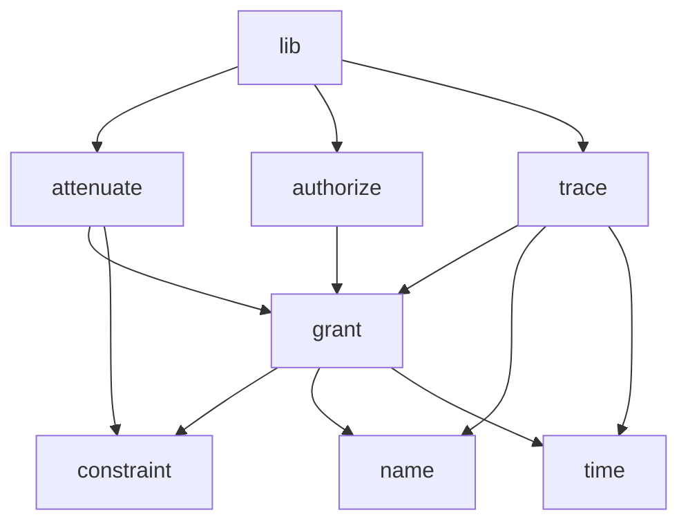
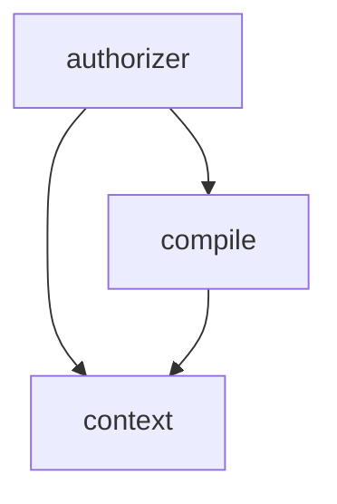
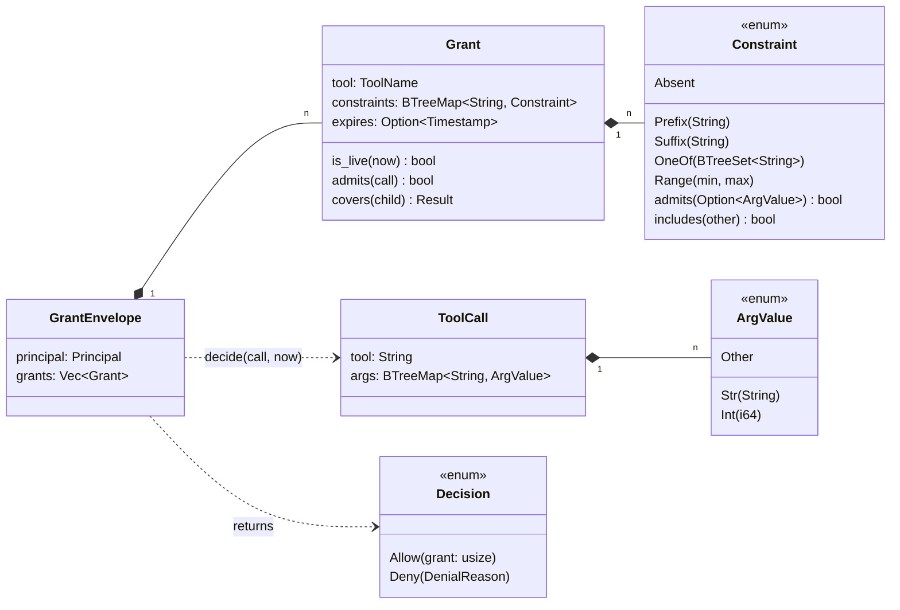
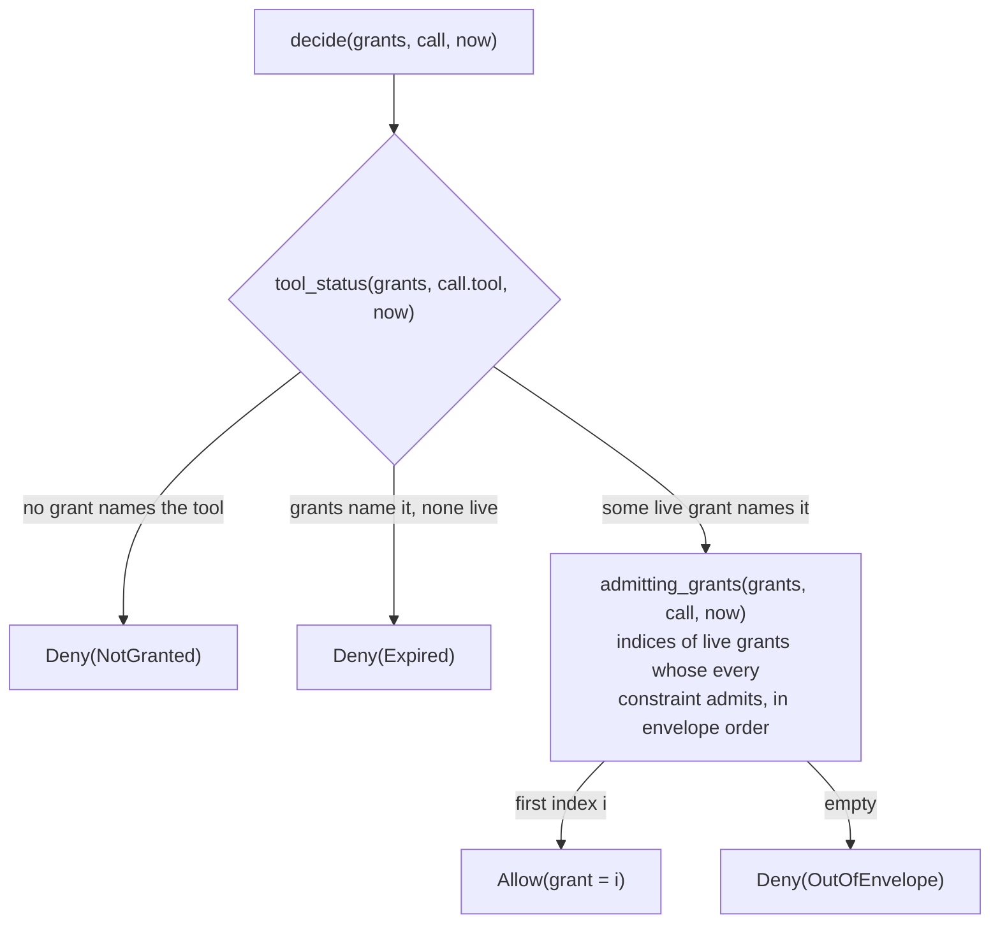
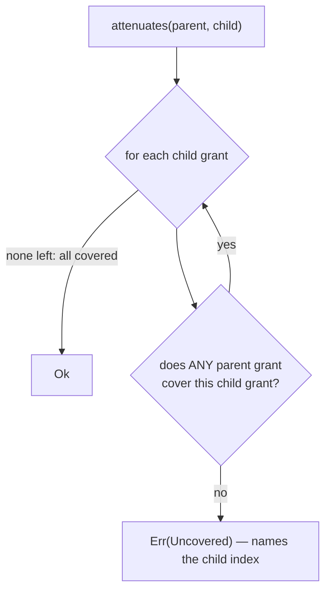
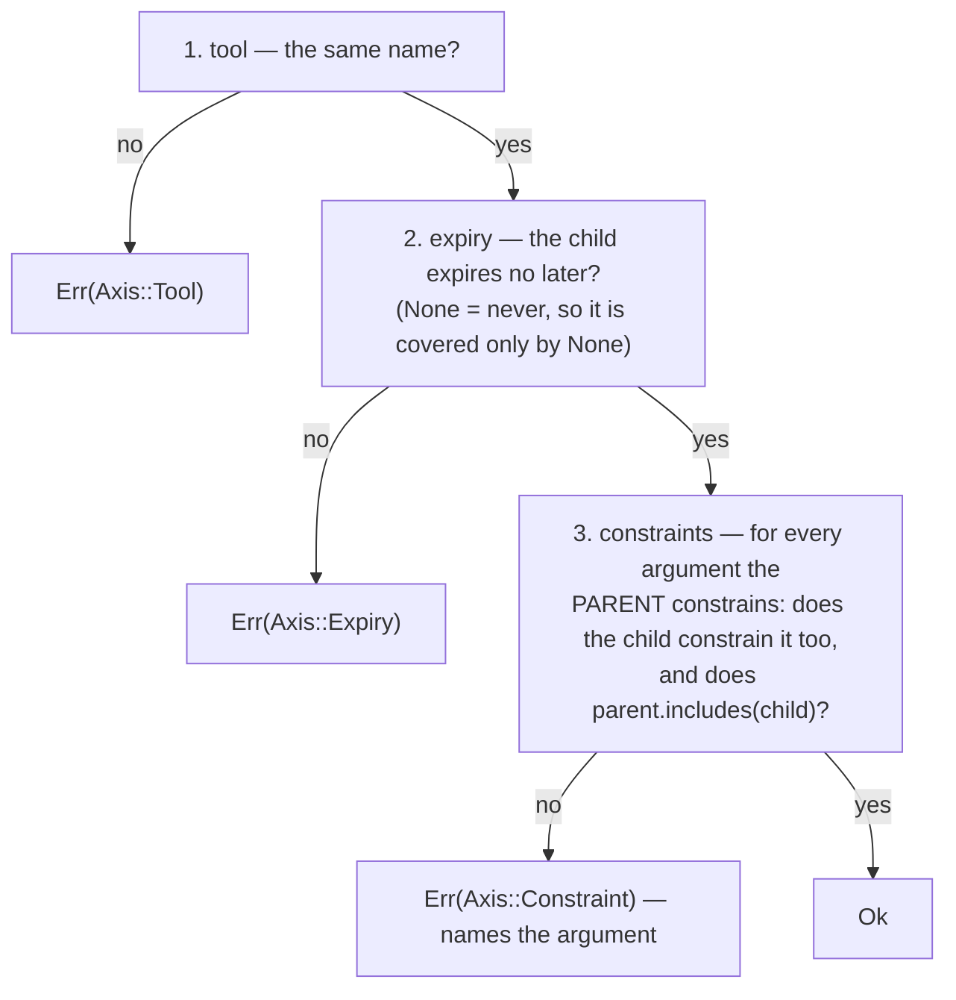
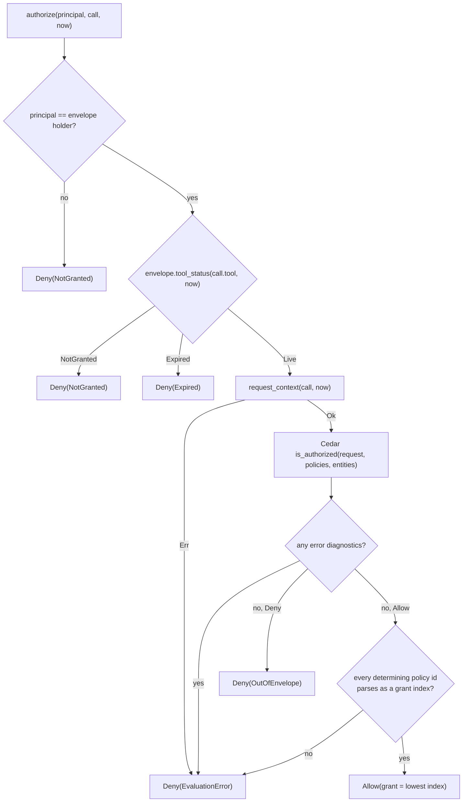

# `flavium-core` and `flavium-policy` — architecture

**As of T1/M5 (2026-08).** These two crates are the enforcement core:
what a grant *is*, what it *means*, what it may be narrowed to, what is
written down about every decision — and the engine that answers, at
runtime, whether one call is inside one agent's authority. Everything
else in the workspace is plumbing around them.

This document is the map for readers and reviewers: the types, the
semantics, the invariants and where each is enforced, the compilation
into Cedar, and one grant followed end to end from a line of TOML to a
line of trace. It is not a specification — [DESIGN.md](../../DESIGN.md)
is the source of truth for the system, and the rustdoc in each crate is
the contract for each item. Where this document and the code disagree,
the code is right and this document has a bug. Vocabulary is fixed in
[GLOSSARY.md](../GLOSSARY.md); the proxy that calls into all of this is
[docs/architecture/proxy-mcp.md](proxy-mcp.md), and the operator's view
of the same machinery is [docs/cli.md](../cli.md).

The milestones behind the code: **M3** built `flavium-core` (types,
reference semantics, attenuation, trace vocabulary —
[plan](../tasks/v0.1/T1-m3-plan.md)), **M4** built `flavium-policy`
(compiler, context, authorizer — [plan](../tasks/v0.1/T1-m4-plan.md)),
**M5** wired both into the proxy and the CLI
([plan](../tasks/v0.1/T1-m5-plan.md)). Decisions are cited below as
**M3/D4**, **M4/D2** and so on; the plans hold the rejected alternatives.

## Contents

1. [What these two crates are](#1-what-these-two-crates-are)
2. [Module map](#2-module-map)
3. [The grant model](#3-the-grant-model)
4. [What a constraint means](#4-what-a-constraint-means)
5. [What a grant set means: the reference decision](#5-what-a-grant-set-means-the-reference-decision)
6. [The denial surface](#6-the-denial-surface)
7. [Attenuation](#7-attenuation)
8. [The trace vocabulary](#8-the-trace-vocabulary)
9. [The engine: a grant becomes a Cedar policy](#9-the-engine-a-grant-becomes-a-cedar-policy)
10. [The request context](#10-the-request-context)
11. [How the engine decides one call](#11-how-the-engine-decides-one-call)
12. [One grant, end to end](#12-one-grant-end-to-end)
13. [Invariants](#13-invariants)
14. [Tests as executable specification](#14-tests-as-executable-specification)
15. [Adding an axis](#15-adding-an-axis)
16. [Notes for verification tooling](#16-notes-for-verification-tooling)

## 1. What these two crates are

`flavium-core` is the **specification**. It defines the vocabulary —
principals, tools, grants, constraints, calls, decisions, trace events —
and it contains one small function, `decide`, that says what a set of
grants *means*. It has **no dependencies at all**, not even
dev-dependencies (M3/D10), no `unsafe`, no `unwrap`/`expect` outside
tests, no clock and no I/O. Every function in it is total: it returns a
value for every input and never panics. `cargo tree -p flavium-core`
prints one line.

`flavium-policy` is the **engine**. It compiles a grant envelope into a
[Cedar](https://www.cedarpolicy.com/) policy set once, at startup, and
answers one authorization question per call. Besides `flavium-core` it
has exactly the three dependencies the T1 plan approved — `cedar-policy`,
`serde_json`, `thiserror` — which is roughly seventy crates once resolved
transitively. It is subject to the same rules as core otherwise: no
`unsafe`, no `unwrap`/`expect` outside tests, no clock, no I/O, and no
panic on the request path.

Why both exist. Something has to *define* what a prefix constraint means;
if only the engine defines it, there is nothing to test the engine
against (M3/D2). And something has to *evaluate* it under a formal
semantics, which is why Cedar is the mandated engine (DESIGN §6): the
policy-evaluation half of the verification story is then someone else's
proven work. The two are held together by one property, checked rather
than assumed:

> **P1 (agreement)** — for every envelope, call and time,
> `CedarAuthorizer::authorize` returns exactly what `flavium_core::decide`
> returns: the same `Decision`, the same grant index, the same
> `DenialReason`.

`crates/flavium-policy/tests/differential.rs` *is* that property, run
over thousands of randomly generated envelopes, calls and times. If Cedar
and the specification ever disagree, that test is where it shows up.



The dashed arrow is the point of the layout. The proxy holds two
`flavium-core` traits — `Authorizer` and `TraceSink` — and never names an
engine (M3/D5), so `cargo tree -p flavium-proxy-mcp` contains no
`cedar-policy`, the proxy's own tests can use the reference
implementation as a test double, and swapping the engine is a change in
one file of the CLI. Only `flavium-cli` mentions `CedarAuthorizer`.

## 2. Module map

Bottom-up: each module depends only on the ones below it in its table.

### `flavium-core`

| Module | One line |
|---|---|
| `name` | `Principal` and `ToolName`: newtypes validated on construction (non-empty, no ASCII control characters), plus `InvalidName`. Used on the **grant** side only. |
| `time` | `Timestamp(i64)`, Unix seconds, comparison only. The crate has no clock; `now` is always an argument. |
| `constraint` | `ArgValue` (`Str`/`Int`/`Other`), `Constraint` (`Prefix`/`Suffix`/`OneOf`/`Range`/`Absent`), `admits` (what a constraint accepts) and `includes` (the per-argument piece of attenuation), plus the two crate-private bound-comparison tables. |
| `grant` | `Grant`, `GrantEnvelope`, `ToolCall`, `ToolStatus`, `Decision`, `DenialReason`, and the free functions `tool_status`, `admitting_grants`, `decide`, `granted_tools`. |
| `attenuate` | `Grant::covers` (one parent grant against one child grant), `attenuates` (set against set), `Axis`, `Uncovered`. |
| `authorize` | The `Authorizer` trait, `impl Authorizer for GrantEnvelope` (the reference implementation), and a blanket impl for `Arc<T>`. |
| `trace` | `TraceEvent` and its payload enums, `CallId`, the `TraceSink` trait, `NullSink`, `MemorySink`. |
| `lib` | Crate docs (the invariants, in one place), `#![forbid(unsafe_code)]`, `#![deny(clippy::unwrap_used, clippy::expect_used)]`, re-exports. |



(`authorize` also names `name` and `time`, in its trait signature; the
edge is left out of the diagram to keep it readable.) `constraint`,
`name` and `time` depend on nothing. `attenuate` reaches into
`constraint` for one thing only — the shared `upper_bound_within`
helper, which compares an expiry exactly the way it compares a numeric
upper bound.

### `flavium-policy`

| Module | One line |
|---|---|
| `context` | `request_context(&ToolCall, Timestamp) -> Result<Context, ContextError>`: the four-key Cedar context, built from `RestrictedExpression`s. Owns the four key names. |
| `compile` | `compile(&GrantEnvelope) -> Result<PolicySet, CompileError>`: one Cedar `permit` per grant, built as structured JSON. Owns the entity types and the EST expression builders. |
| `authorizer` | `CedarAuthorizer`: the compiled artifacts plus `impl flavium_core::Authorizer`, and the classification of Cedar's answer into a `Decision`. |
| `lib` | Crate docs (P1–P5), re-exports. |



`compile` depends on `context` only for the four key names, so the shape
the compiler reads and the shape the context writes cannot drift apart.

## 3. The grant model



**A `Grant` is authority over exactly one tool** — argument constraints
plus an optional expiry — and it carries no holder. The principal lives
on the `GrantEnvelope` (M3/D1), because attenuation compares *authority*,
and a child envelope is held by a different principal by construction:
had the principal stayed inside `Grant`, the headline invariant ("child ⊆
parent on every axis") would have needed a permanent exception for the
one axis that always differs. DESIGN's five-tuple (principal, tool,
constraints, expiry, budget) is not lost — it is `GrantEnvelope.principal
× Grant`, with budget reserved for T2 (M3/D7).

**Grant order is significant and stable.** `grants` is a `Vec` in file
order, indices appear in `Decision::Allow { grant }` and in the trace, and
they become Cedar policy ids. Nothing re-sorts or dedupes it.

**A `ToolCall` is what the proxy hands over**, converted from JSON before
it arrives: a missing or `null` `arguments` object is an empty map, JSON
strings become `Str`, integers that fit `i64` become `Int`, and everything
else — floats, booleans, `null`, arrays, objects, integers outside `i64`,
and the spellings `-0`, `3.0`, `1e3` — becomes `Other`. An `arguments`
that is not an object, or that has duplicate keys, never becomes a
`ToolCall` at all: it is refused at the proxy's parse boundary as
`RefusalReason::MalformedParams`. `ToolCall.tool` is a plain `String`,
not a `ToolName`: a client may ask for any name, and one that could never
be a valid `ToolName` simply matches no grant and falls out as
`NotGranted` — fail closed with no special path (M3/D9).

**`Timestamp` is `i64` Unix seconds, and the caller supplies it** (M3/D8).
`i64` seconds is what Cedar's `long` and the usual `timestamp()`
accessors both speak, so nothing can go wrong in conversion at the engine
boundary; a core with no clock is what makes a decision replayable from
envelope + call + `now`, and what keeps ambient state out of the
verification target. A grant is live iff `now < expires`, strictly — at
`now == expires` it is already gone.

## 4. What a constraint means

A `Constraint` is attached to an argument **name** and is checked against
the value the call supplies for that name, or `None` when the call did
not supply it. `Constraint::admits(Option<&ArgValue>) -> bool` is total:
every (constraint, value) pair yields a `bool`.

| Variant | Admits `v` iff |
|---|---|
| `Prefix(p)` | `v` is `Str(s)` and `s` starts with `p` (bytes) |
| `Suffix(x)` | `v` is `Str(s)` and `s` ends with `x` (bytes) |
| `OneOf(set)` | `v` is `Str(s)` and `s ∈ set` |
| `Range{min, max}` | `v` is `Int(n)` and `min ≤ n ≤ max`, a `None` bound being no bound |
| `Absent` | `v` is `None` — the argument must not be supplied |

Everything not in that table is **not admitted**. Spelled out, because
each row is a fail-closed choice rather than an omission:

- a constrained argument that is **missing** is denied (except under
  `Absent`, which is the only constraint that wants a missing value);
- a constrained argument of the **wrong type** is denied — `Prefix`
  against `Int(5)`, `Range` against `Str("5")`;
- a constrained argument that is `ArgValue::Other` is denied by *every*
  constraint, which is what makes an unmodelled JSON shape safe to carry:
  it can be reported in a trace as having been present without ever being
  admitted;
- `OneOf({})` admits nothing, and a `Range` with `min > max` admits
  nothing. Both are startup *warnings* in the grant file, not errors:
  they cost availability, never authority.

Two rows are the opposite direction and are the documented authoring
traps (M3/D3), repeated here because they are the shape a reader gets
wrong:

- **`Prefix("")` and `Suffix("")` admit every string.** They are legal —
  they are your own bytes — and the grant loader warns about them.
- **Comparison is byte-wise, with no normalization anywhere in this
  crate.** `Prefix("/data/inv")` admits `/data/invalid`: it is a byte
  prefix, not a path-component prefix. `Suffix("yourco.com")` admits
  `x@evilyourco.com`: write the `@`. Case matters *here* — the one place
  it does not is a `windows-path-prefix` argument, and even then the
  folding happens in the proxy, not in this crate, so both the prefix and
  the value have already been folded by the time they meet. Path
  normalization — separators, `.`, `..`, and that ASCII case folding —
  happens in the proxy *before* the value reaches
  core, and only for arguments a grant declared path-flavored; see
  [proxy-mcp §10](proxy-mcp.md#10-where-enforcement-plugs-in) and
  [cli.md §4](../cli.md#4-grants).

**And the trap that is about what a grant does *not* say:** arguments no
constraint mentions are never examined. A `send_mail` grant that
constrains only `to` lets the agent put anything in `bcc`. That is why
`Absent` exists (M3/D3) — it is the only way to say "this argument must
not be supplied", and closing `cc`/`bcc` with it is precisely the
exfiltration hole the flagship demo has to close. It was added during
planning rather than later, because changing `decide`'s core rule inside
the verification target is the most expensive kind of late change.

```rust
use flavium_core::{ArgValue, Constraint};

let path = Constraint::Prefix("/data/invoices/".to_string());
assert!(path.admits(Some(&ArgValue::Str("/data/invoices/2026-01.pdf".into()))));
assert!(!path.admits(Some(&ArgValue::Str("/data/invoices".into())))); // shorter
assert!(!path.admits(Some(&ArgValue::Int(1))));                       // wrong type
assert!(!path.admits(Some(&ArgValue::Other)));                        // unmodelled
assert!(!path.admits(None));                                          // missing

// The only constraint that wants a missing value.
assert!(Constraint::Absent.admits(None));
assert!(!Constraint::Absent.admits(Some(&ArgValue::Str(String::new()))));
```

## 5. What a grant set means: the reference decision

`decide(grants, call, now)` is the executable specification. It is
deliberately not clever: a reader should be able to confirm the
crate-level "semantics in one paragraph" line by line against it.



Three things about this shape are load-bearing.

**The tool axis is decided before the argument axis.** `tool_status`
answers `NotGranted` / `Expired` / `Live` first, so the reason a call was
denied never depends on its arguments when the tool itself is not
available. An expired grant is treated as absent, everywhere and
identically (INV-3): the tool disappears from `granted_tools`, and every
call on it answers `Expired` regardless of how well-formed the arguments
are. One fact with two faces.

**A grant for another tool lends no authority.** `Grant::admits` checks
the tool name first, so an unconstrained grant on `a` contributes nothing
to a call on `b`. Obvious, and it is a unit test, because "the grant that
admits everything" is exactly the kind of thing an incorrect refactor
lets leak sideways.

**`Allow` names the first admitting live grant**, in envelope order, and
`admitting_grants` returns *all* of them. The distinction is not
cosmetic: under T2's per-grant budgets the meter will want the first
admitting grant *with budget left*, and `admitting_grants` exists so that
can be built without changing `Decision` (M3/D7).

```rust
use std::collections::BTreeMap;
use flavium_core::{
    ArgValue, Constraint, Decision, DenialReason, Grant, GrantEnvelope, InvalidName,
    Principal, Timestamp, ToolCall, ToolName,
};

fn example() -> Result<(), InvalidName> {
    let envelope = GrantEnvelope {
        principal: Principal::new("invoice-bot")?,
        grants: vec![Grant {
            tool: ToolName::new("read_file")?,
            constraints: BTreeMap::from([(
                "path".to_string(),
                Constraint::Prefix("/data/invoices/".into()),
            )]),
            expires: Some(Timestamp::from_unix_secs(1_788_220_800)), // 2026-09-01Z
        }],
    };
    let call = |path: &str| ToolCall {
        tool: "read_file".into(),
        args: BTreeMap::from([("path".to_string(), ArgValue::Str(path.into()))]),
    };
    let now = Timestamp::from_unix_secs(1_786_871_604);

    assert_eq!(envelope.decide(&call("/data/invoices/2026-01.pdf"), now),
               Decision::Allow { grant: 0 });
    assert_eq!(envelope.decide(&call("/etc/passwd"), now),
               Decision::Deny(DenialReason::OutOfEnvelope));
    // The expiry boundary is exclusive: at `now == expires` the grant is gone.
    assert_eq!(envelope.decide(&call("/data/invoices/2026-01.pdf"),
                               Timestamp::from_unix_secs(1_788_220_800)),
               Decision::Deny(DenialReason::Expired));
    assert_eq!(envelope.decide(&ToolCall { tool: "send_mail".into(), args: BTreeMap::new() }, now),
               Decision::Deny(DenialReason::NotGranted));
    Ok(())
}
```

### The `Authorizer` seam

The proxy never calls `decide`. It calls a trait:

```rust
pub trait Authorizer: Send + Sync {
    fn authorize(&self, principal: &Principal, call: &ToolCall, now: Timestamp) -> Decision;
    fn granted_tools(&self, principal: &Principal, now: Timestamp) -> BTreeSet<ToolName>;
}
```

No I/O, no clock: the caller supplies `now`, so every answer is
replayable. `GrantEnvelope` implements it as the *reference*
implementation — the envelope authorizes exactly its holder, and any
other principal holds nothing — which is what the proxy's own tests use
as a double. `CedarAuthorizer` implements it for production. The two
methods must agree on the tool axis: a tool outside `granted_tools` is
`NotGranted` or `Expired` for every call (INV-3), which is what makes the
filtered `tools/list` consistent with the gate rather than an oracle
about it.

One ergonomic wart, documented where it bites: `GrantEnvelope` has both
the inherent `granted_tools(now)` and the trait's
`granted_tools(principal, now)`. Method-call syntax on a concrete
envelope resolves to the inherent one, so calling the trait method on a
concrete envelope needs
`Authorizer::granted_tools(&envelope, &principal, now)`. An arity
mismatch is a compile error, never a silent fallback.

## 6. The denial surface

`DenialReason` has four variants, and the split between them is a
client-visible security decision, not a diagnostic nicety.

| Reason | Produced when | What the client sees | Why |
|---|---|---|---|
| `NotGranted` | No grant names the tool (or the principal is not the envelope's holder) | `-32602 Unknown tool: x` | Byte-identical to a tool no upstream offers. |
| `Expired` | Grants name the tool, none is live | `-32602 Unknown tool: x` | An expired grant is no grant, and the filtered list agrees with it. |
| `OutOfEnvelope` | A live grant names the tool, no live grant admits these arguments | A **successful** response carrying `isError: true`, `"denied by policy"` | The agent named a tool it holds and may retry inside the envelope. It says nothing about what the envelope is. |
| `EvaluationError { detail }` | The engine could not evaluate and denied, fail closed. **Never produced by `decide`** | The same `isError` shape as `OutOfEnvelope` | Answering `-32603` would tell the agent the failure is not its fault, which invites a retry loop; the detail goes to the trace and the operator's log. |

The first two rows are the important ones. **Denial and nonexistence are
deliberately indistinguishable** (the proxy's W6/I17): both refusals come
from one function, and every other refusal that could differentiate them
— a duplicate request id, in particular — is raised *before* the tool
table is consulted, so it cannot become an oracle either. Otherwise the
pair of error codes would tell a client exactly which tools exist
upstream, which is the set the filtered `tools/list` exists to hide.

`EvaluationError` lives in core, even though core never produces it, so
that `Decision` and the trace types are shared between the specification
and every engine. It is the one denial that means "look at the engine",
not "the agent asked for something it does not have" — which is why the
engine checks Cedar's error diagnostics *before* Cedar's decision (§11).

## 7. Attenuation

Attenuation is the invariant the whole product rests on: **authority only
ever narrows as it flows down**. `attenuates(parent, child)` is the check
delegation runs at spawn (T3); it exists and is property-tested now, ahead
of the feature that will call it, because it is the shape of the theorem.

It is built in two layers.

At the set level, `attenuates` asks one question per child grant:



At the grant level, `Grant::covers` checks three axes in a fixed order
and reports the first that fails:



Read the third axis carefully, because both halves matter. The iteration
is over the **parent's** constraints: a child may *add* constraints on
arguments the parent says nothing about (that is narrowing), but it may
never **drop** one the parent set — a missing child constraint is not
covered, full stop — and it may never **widen** one.

`Constraint::includes(other)` is the per-argument piece: does *this*
constraint admit every value *that* one admits? It is a structural table:

| `self` (parent) | `other` (child) | `true` iff |
|---|---|---|
| `Absent` | `Absent` | always |
| `Prefix("")` or `Suffix("")` | any `Prefix`/`Suffix`/`OneOf` | always — the parent admits every string, the child only strings |
| `Prefix(p)` | `Prefix(c)` | `c` starts with `p` |
| `Suffix(p)` | `Suffix(c)` | `c` ends with `p` |
| `OneOf(P)` | `OneOf(C)` | `C ⊆ P` |
| `Prefix(p)` | `OneOf(C)` | every element of `C` starts with `p` |
| `Suffix(p)` | `OneOf(C)` | every element of `C` ends with `p` |
| `Range{pmin, pmax}` | `Range{cmin, cmax}` | `pmin` is no bound or `cmin ≥ pmin`, **and** `pmax` is no bound or `cmax ≤ pmax` |

Everything else is `false`. In particular: anything with `Absent` on one
side only (a child that admits *missing* is wider than a parent that
requires presence, and the reverse), a string kind against `Range`, and
`OneOf` as the parent of a `Prefix`/`Suffix` child (a finite set can
never contain an infinite one).

### Sound, not complete — on purpose

`attenuates` never accepts a child that could do something the parent
cannot (**INV-1**). It may refuse a child that genuinely is a subset. The
canonical case, which has a test of its own
(`union_of_parents_is_conservatively_refused`), sketched here with the
test's helpers:

```rust
// Parent: two grants on `read`, one for /a and one for /b.
let parent = vec![grant("read", &[("path", prefix("/a"))], None),
                  grant("read", &[("path", prefix("/b"))], None)];

// Child: ONE grant admitting exactly {"/a/1", "/b/1"} — semantically
// inside the union, but inside NEITHER parent grant alone.
let child = vec![grant("read", &[("path", one_of(&["/a/1", "/b/1"]))], None)];
assert_eq!(attenuates(&parent, &child), Err(Uncovered { child: 0 }));

// Written grant by grant, the same authority passes.
let child = vec![grant("read", &[("path", one_of(&["/a/1"]))], None),
                 grant("read", &[("path", one_of(&["/b/1"]))], None)];
assert_eq!(attenuates(&parent, &child), Ok(()));
```

Soundness is the property the theorem needs; completeness is a
convenience (M3/D4). Refusing a subset written in a shape the table does
not recognise costs an operator a more explicit grant file. It never
costs authority, and it never grants any.

"Strictly attenuates" in DESIGN means *always enforced ⊆*, not proper
subset: a child equal to its parent is legal (**INV-5**, reflexivity).
What is forbidden is any widening.

### The one-line bug this crate exists not to have

Expiry and numeric bounds are compared by two explicit four-row tables
rather than by comparing `Option`s:

```rust
pub(crate) fn upper_bound_within<T: Ord + Copy>(parent: Option<T>, child: Option<T>) -> bool {
    match (parent, child) {
        (None, _) => true,           // parent unbounded: anything is within
        (Some(_), None) => false,    // child unbounded: reaches above the parent
        (Some(p), Some(c)) => c <= p,
    }
}
```

The obvious one-liner — `child.expires <= parent.expires` — is wrong in a
way that is invisible on the page: derived `Ord` on `Option` puts `None`
*below* every `Some`, so it would accept a **never-expiring child under an
expiring parent**. That single line is the bug class this crate exists not
to have, so it is written as a table, has its own row-by-row unit test,
and was mutation-tested by hand (M3/D4).

The same helper does double duty for `Range`'s upper bound and for
expiry, which is exactly right: "expires no later than" and "reaches no
higher than" are the same question.

### Only the child index is reported

`Uncovered { child }` names the child grant, not an axis. With several
parent grants naming the same tool, each may fail on a different `Axis`,
so a single axis would be misleading. A caller wanting detail runs
`Grant::covers` against each candidate itself.

## 8. The trace vocabulary

If it is not traced, it is not done. `flavium-core` fixes the vocabulary
and the seam; it does no I/O and has no clock. The CLI supplies a JSONL
sink (M5); T4 supplies the hash-chained recorder with deterministic
replay.

```rust
pub trait TraceSink: Send + Sync {
    fn record(&self, event: &TraceEvent) -> Result<(), SinkError>;
}
```

Four design points, so sinks and future variants stay consistent (M3/D6):

- **Exhaustive on purpose.** `TraceEvent` is *not* `#[non_exhaustive]`.
  A sink must handle every variant at compile time, so adding one — T2
  budgets, T3 spawn and termination — is a wanted compile-error ripple
  through every sink, never a silently unserialized event. The audit
  record is the one thing that may not have silent gaps.
- **Clock-free.** An event carries what enforcement computed, including
  the `now` a decision was made with — replaying a decision needs exactly
  envelope + call + `now`. Wall-clock time, sequence numbers, hashes and
  the session identifier are the recorder's to add.
- **Ordered.** The proxy emits from one task in causal order, so a sink
  may assign sequence numbers or chain hashes under its own lock without
  one being imposed here.
- **Fallible.** `record` returns an error so the runtime can fail closed
  on audit. The proxy's policy (I15): a sink failure ends the session and
  the process exits non-zero. A full disk should stop the agent, not run
  it unrecorded.

The catalog, keyed by a per-session monotonic `CallId` the proxy mints:

| Event | Fields | When |
|---|---|---|
| `SessionStarted` | `envelope` | Once, after startup succeeded. The policy in force, so every later `Allow { grant }` index can be read against it. A run that fails during startup has no session and leaves no trace. |
| `HandshakeCompleted` | offered and negotiated protocol version, `client_name`, `client_version` | The client's `initialize` was answered. All four are untrusted client data, recorded so protocol drift is observable — **never identity**. |
| `ToolsListed` | `principal`, `now`, `offered`, `granted` | Each `tools/list`. |
| `CallRefused` | `principal`, `call_id`, `tool: Option<String>`, `reason` | A `tools/call` refused **before** any grant decision: `MalformedParams`, `UnknownTool`, `DuplicateRequestId`. Protocol-level, not policy. |
| `CallDecided` | `principal`, `call_id`, `call`, `now`, `decision` | Every authorized call. `call` is the call **as evaluated** — normalized arguments — because a record that disagreed with the decision it records could not reproduce it. |
| `CallCompleted` | `principal`, `call_id`, `outcome` | Every allowed call, exactly once: `Result{is_error}`, `Error{code}`, `NotForwarded(…)`, `Cancelled`, `Abandoned`. |
| `FrameRejected` | `code` | A client frame failed at the parse boundary. |
| `FrameDiscarded` | `kind` | A frame consumed without being forwarded or answered (nine kinds). |
| `UpstreamEnded` | `upstream`, `error: Option<String>` | An upstream connection ended; secrets already redacted by the emitter. |
| `SessionEnded` | `reason`, `undelivered`, `delivery_failed` | Last. Clean iff `ClientEof` and not `delivery_failed` — the exit-code criterion. |

**The per-call grammar is worth stating as a rule**, because it is what a
reader of a trace relies on: one `tools/call` produces *either* one
`CallRefused` *or* one `CallDecided`, and a `CallDecided` that allowed
the call is always followed by exactly one `CallCompleted` — including
for calls that never come back (not forwarded, cancelled, or abandoned
when the session ends with the call in flight). One call, one terminal
event.

Two sinks ship in core for tests and for explicitly untraced runs:
`NullSink` discards everything, and `MemorySink` keeps events in order.
`MemorySink` tolerates a poisoned lock — a panic on another thread cannot
have left the `Vec` inconsistent — so a test that panics elsewhere still
reports what was recorded rather than a second, less informative panic.

## 9. The engine: a grant becomes a Cedar policy

One grant compiles to exactly one Cedar `permit`, whose policy id is the
grant's index in the envelope (M4/D1). Nothing else is ever emitted — in
particular **no `forbid`**.

Two properties fall out for free. Deny-by-default becomes *structural*
rather than a rule that could be misordered: a call no permit covers is
denied because nothing allowed it, not because a rule said so (**P2**).
And when Cedar says "allowed" it names the policy that did it, and that
name *is* the grant index — so `Decision::Allow { grant }` maps back to
the exact grant with no bookkeeping, and a trace can point an auditor at
the line of the grant file that authorized a call.

The policy's scope pins the three axes that do not depend on the call:

```cedar
permit(
  principal == Flavium::Principal::"invoice-bot",
  action    == Flavium::Action::"call",
  resource  == Flavium::Tool::"read_file"
) when { … };
```

and the `when` body is the conjunction of one expression per constraint,
plus one for the expiry:

| Constraint | Cedar |
|---|---|
| `Prefix(p)` | `context.str has <arg> && context.str.<arg> like "<p>*"` |
| `Suffix(s)` | `context.str has <arg> && context.str.<arg> like "*<s>"` |
| `OneOf(set)` | `context.str has <arg> && […].contains(context.str.<arg>)` |
| `Range{min,max}` | `context.int has <arg>`, then `min <= context.int.<arg>` and/or `context.int.<arg> <= max` — an absent bound emits no comparison |
| `Absent` | `!(context.present.contains("<arg>"))` |
| expiry `Some(t)` | `context.now < t` |
| no constraints, no expiry | `true` |

Every reference to an argument's *value* sits behind a `has` guard, and
that is what makes a Cedar evaluation error unreachable rather than
merely unlikely: a missing argument fails its guard, and an argument of
the wrong type is in the other submap (or, for `Other`, in neither), so
it fails the guard too. Both deny — exactly what the reference semantics
do. `Absent` needs no guard: it asks whether a name is in a set, which
cannot error.

### Nothing is ever parsed (P4)

Policies are built as Cedar's JSON policy format (EST) and parsed with
`Policy::from_json`; entity UIDs are built with `EntityUid::from_json`.
No part of a grant is ever formatted into a string of Cedar source
(M4/D2). Grant values are *data* — a path, an address pattern, a tool
name — and data must never be able to become syntax. Text-building a
policy would put a quote or a backslash from a grant file one escaping
bug away from changing what the policy means; the structured path has no
such bug to make.

Two consequences, both verified against Cedar rather than reasoned about:

- an entity id containing `"` or `\` survives intact through
  `from_json`, where `EntityUid::from_str` fails outright — so
  text-built UIDs would be both fragile and unsafe;
- a `like` pattern is an array of literal and wildcard pieces, so Cedar
  escapes the literal itself: `Prefix("/a*b\\c")` renders as
  `like "/a\*b\\c*"`, matches `/a*b\c/d`, and does **not** match
  `/aQQb\c/d`. **A `*` inside a grant is a plain character.**

P4 is stated as "nothing is ever *parsed*" rather than "no string is ever
*interpolated*" because the weaker version was not enough — see §10 for
the `__expr` defect that forced the restatement. Not being *formatted*
into a grammar is no protection if you are still *read* by one.

### The conjunction is a balanced tree

`&&` over N conjuncts is built by splitting the list down the middle,
not by folding left. Folding left made a grant with N constraints an
N-deep spine, and Cedar's parse of that JSON is recursive: **a grant with
sixteen constrained arguments — an ordinary tool signature — overflowed
the stack and aborted the process.** Halving makes the depth `log2(N)`,
so the failure mode is gone rather than pushed further out; 4096
constrained arguments now compile, and 16 / 64 / 4096 are regression
tests.

Reassociating is sound because every conjunct is *total*: each evaluates
to a `bool` for every possible context and never to an error (that is
what the `has` guards buy), so no grouping can change the result — only
which conjuncts Cedar's short-circuit skips. This is why the rendered
form groups oddly, and why `a_representative_grant_renders_as_expected`
exists: a change to the encoding must be visible in a diff.

### `CompileError` is a startup failure, always

Every variant — `EntityUid`, `Policy`, `PolicySet` — means Cedar refused
something generated. None is reachable from a grant the core can
construct; the type exists so that "unreachable" is a typed result rather
than a panic, and so that a grant which somehow cannot be compiled stops
the process **while an operator is watching**, rather than surfacing
mid-session as a denial that looks like policy (M4/D7).

### No Cedar schema

Flavium declares no schema and does not run Cedar's validator (M4/D4). A
schema's job is to catch type errors in policies before they run; ours
are not written by anyone — they are generated from a closed vocabulary
of five constraint kinds, and the `has` guards already remove the error
class a schema would catch. What a schema *would* add is an obligation
with a nasty failure mode: Cedar records must declare their attributes,
so it would have to list every argument name appearing in every grant of
a given file, and any drift between that list and the compiler would turn
into blanket denials.

## 10. The request context

Cedar policies read the call's arguments out of the request *context*, a
record built fresh for every call. Its shape is fixed — **four keys,
always, whatever the call looks like**:

```text
{ str: {"path": "/data/x"}, int: {"n": 5}, present: ["path", "n"], now: 1700000000 }
```

- `str` — the call's string arguments by name;
- `int` — the call's `i64` arguments by name;
- `present` — the names of **every** argument the call supplied,
  including ones in neither submap;
- `now` — the decision time, as a Cedar `long`.

`present` is the only way `Absent` can be expressed: "no value here" is
not something a value-typed lookup can say, so the set of supplied names
is passed explicitly. `ArgValue::Other` appears in `present` and in
neither submap, so a constraint's `has` guard fails and the call is
denied — which is what the reference semantics do too. The two
implementations agree *by construction* instead of one erroring where the
other denies.

Emitting all four keys unconditionally is **P5**, and it is the reason a
Cedar evaluation error is unreachable rather than merely unlikely: a
missing context key is the one way flavium's own policies could raise one
(verified — Cedar reports "record does not have the attribute").

### Why `RestrictedExpression` and not JSON

This is the defect that renamed P4, and it is worth reading as a story
rather than a rule.

Argument names come from the client and are validated **nowhere** — an
MCP tool may take a parameter called anything at all, and validating
names there would add an error path and a new client-visible failure for
no gain. The context was first built as a `serde_json::Value`. No
interpolation anywhere; every value placed structurally. And yet a call
whose only string argument was named `__expr` broke P1.

Cedar's *JSON value* parser reserves three keys — `__expr`, `__entity`,
`__extn` — as escapes. A single-key record spelled `{"__expr": "…"}` is
not read as a record with an oddly-named field but as a (removed) escape,
so the whole context failed to parse and the engine denied a call the
specification allows — reported to the operator as "the engine broke".
A client could reach that from outside, using nothing but one of its own
tool's argument names.

Building the context with `RestrictedExpression` skips the value grammar
altogether: names are carried as record keys verbatim, in no vocabulary
where any of them means something. The differential suite's hostile
universe now carries `__expr` as a regression guard, and a unit test
walks `__expr`, `__entity`, `__extn`, `""`, `a"b`, `é`, `\n`, `context`,
`str` and `now` through as ordinary argument names — including checking
that an argument called `str` or `now` shadows nothing.

The general shape, worth carrying to any code downstream of a client:
**something is read by a grammar you never formatted into.** Argument
names are client-supplied and validated nowhere *by design*, so anything
that treats one as more than bytes is this bug again. The defect and its
fix are recorded at the head of the
[M4 plan](../tasks/v0.1/T1-m4-plan.md), with the two other things that
milestone found.

`ContextError`'s two variants are unreachable from a `ToolCall` — its
arguments are a map, so no submap can have a duplicate key, and the four
context keys are distinct literals. The type exists so the request path
cannot panic, and so that a future change which makes it reachable denies
(**P3**) instead of aborting.

## 11. How the engine decides one call

Four steps, and only the third is Cedar's.



**Cedar is only asked about the argument axis.** It answers Allow or
Deny; it has no vocabulary for "the tool is not in your envelope at all"
versus "your grant for it expired" versus "these arguments are outside
it" — and that distinction is exactly what the client sees (§6). Deriving
it from the envelope keeps the classification in one place and keeps
`granted_tools` and `authorize` agreeing on the tool axis **by
construction** (INV-3) rather than by two implementations happening to
match (M4/D5). `granted_tools` delegates to core entirely, so the tool
axis has exactly one implementation in the whole workspace.

A corollary worth stating: because Cedar is only ever asked about a tool
some grant names, the resource UID is looked up from the compiled map of
validated `ToolName`s. **A client's arbitrary tool string never reaches
the engine.**

**Errors are checked before the decision, unconditionally.** The engine
failing to evaluate is never a reason to allow — but the subtler half is
the sibling case, where Cedar errors *and* reaches `Deny` on its own.
Both paths deny, so only the reason distinguishes them, and the reason is
what an operator acts on: `EvaluationError` means "the engine broke, look
at it"; `OutOfEnvelope` means "the agent asked for something it does not
have, which is the system working". Reporting the second when the first
happened would hide an engine failure as routine policy. Both orders are
pinned by tests.

**The *lowest* determining policy id, not the first.** Cedar reports the
determining policies as an unordered set — verified: it comes back in a
different order than the grants went in — so taking the minimum index is
what reproduces the reference semantics' "first admitting live grant".
And the minimum is *numeric*, not lexical: policy ids sort as strings
inside Cedar, where `"10" < "2"`, so a lexical minimum would answer 10
where the specification answers 2. There is a test with twelve grants
that fails on exactly that mistake.

Everything that could be built once is built once (M4/D7): the policy
set, the principal UID, the action UID, the per-tool UIDs, and an empty
entity store — flavium has no entity hierarchy, so all authority is in
the policies. `authorize` builds only the per-call context.

## 12. One grant, end to end

This section follows a single grant through every layer. **It is a
transcript, not a reconstruction:** the config below was run against the
real binary and the `scripted_upstream` fixture, and the stdout, trace
and rendered policy are copied from that run.

### 12.1 What the operator writes

The grant file is the only language flavium asks anyone to write
([cli.md §3–4](../cli.md#3-the-config-file)):

```toml
version = 1
principal = "invoice-bot"

[[upstream]]
name = "fs"
command = ["…/scripted_upstream", "read_file"]

[[grant]]
tool = "read_file"
expires = 2026-09-01T00:00:00Z
[grant.args]
path = { path-prefix = "/data/invoices/" }
```

### 12.2 What the loader makes of it

`flavium-cli`'s `grants.rs` parses the file as one document with
`deny_unknown_fields` everywhere, and produces two things:

```rust
GrantEnvelope {
    principal: Principal("invoice-bot"),
    grants: vec![Grant {
        tool: ToolName("read_file"),
        constraints: { "path": Constraint::Prefix("/data/invoices/") },
        expires: Some(Timestamp(1_788_220_800)),   // 2026-09-01T00:00:00Z
    }],
}
// … and the path-flavor map:
PathFlavors { ("read_file", "path") → PathFlavor::Posix }
```

Three things happen here and nowhere else:

- **`path-prefix` becomes a plain `Prefix`** — core has no notion of
  paths — *and* registers the `(tool, argument)` pair as path-flavored so
  the proxy will normalize that argument before deciding. The prefix
  itself is normalized at load time, and a prefix that normalizes to
  nothing (`"."`, `"./"`, `"a/.."`) is a **startup error**, not an empty
  prefix: an empty prefix admits every string, so accepting one would let
  normalization — the step that exists to prevent widening — produce the
  widest possible constraint.
- **`expires` becomes Unix seconds.** A TOML date-time without a UTC
  offset is refused: `2026-09-01T00:00:00` is a different instant in
  every time zone, and a security artifact may not have an ambiguous
  field. Sub-second precision is dropped, which moves an expiry at most
  one second *earlier* — the fail-closed direction.
- **Ambiguity is refused while an operator is watching.** Zero or two
  constraint keys on one argument, `absent = false`, a `range` with
  neither bound, `budget` (the T2 axis, deliberately not modelled), the
  same `(tool, argument)` constrained both as a path and as bytes — all
  startup errors. Grants that can only ever *deny* — an empty `one-of`, a
  `min` above its `max`, a tool no upstream offers — are warnings, kept.

### 12.3 What the engine compiles it to

`CedarAuthorizer::new(envelope)` compiles the whole envelope up front.
The rendered policy — printed straight from `PolicySet`:

```cedar
permit(
  principal == Flavium::Principal::"invoice-bot",
  action == Flavium::Action::"call",
  resource == Flavium::Tool::"read_file"
) when {
  (((context.str) has path) && (((context.str).path) like "/data/invoices/*"))
  && ((context.now) < 1788220800)
};
```

One `permit`, id `"0"`, which is the grant's index. An envelope with no
grants compiles to a policy set with zero policies, which allows nothing
(**P2**).

### 12.4 What one call becomes

The agent calls `read_file` with `path =
"/data/invoices/../../etc/passwd"`. Before anything reaches core, the
proxy normalizes it, because this `(tool, argument)` pair was declared
path-flavored — `/etc/passwd`. The request context built for the call:

```text
{ int: {}, now: 1786871604, present: ["path"], str: {path: "/etc/passwd"} }
```

Cedar evaluates the policy against it: the `has` guard passes, the `like`
fails, no permit matches, decision `Deny`, no error diagnostics ⇒
`Decision::Deny(DenialReason::OutOfEnvelope)`.

Note what normalization did and did not touch. **The decision and the
trace use the normalized value; the frame the upstream would have
received keeps the client's original bytes** (the proxy's I16). Without
normalization the byte prefix `/data/invoices/` matches happily while the
upstream opens `/etc/passwd` — the textbook false allow, and the reason
the path flavor is declared per grant rather than guessed from the
proxy's own host.

### 12.5 What the client sees

The whole session, verbatim from the run — five client requests, five
answers:

```jsonl
{"jsonrpc":"2.0","id":1,"result":{"protocolVersion":"2025-11-25","capabilities":{"tools":{"listChanged":true}},"serverInfo":{"name":"flavium","title":"Flavium MCP proxy","version":"0.1.0-alpha.0"}}}
{"jsonrpc":"2.0","id":2,"result":{"tools":[{"name":"read_file","description":"Echoes its arguments back.","inputSchema":{"type":"object"}}]}}
{"jsonrpc":"2.0","id":4,"result":{"content":[{"type":"text","text":"denied by policy"}],"isError":true}}
{"jsonrpc":"2.0","id":5,"error":{"code":-32602,"message":"Unknown tool: send_mail"}}
{"jsonrpc":"2.0","id":3,"result":{"content":[{"type":"text","text":"{\"name\":\"read_file\",\"arguments\":{\"path\":\"/data/invoices/2026-01.pdf\"}}"}]}}
```

- **id 3** (`/data/invoices/2026-01.pdf`) was allowed and forwarded.
- **id 4** (the traversal) got the `isError` shape — recoverable, and
  carrying nothing about what the envelope is.
- **id 5** (`send_mail`) got `-32602` — the same bytes a tool that *is*
  offered upstream but that no grant names would get. Both come from one
  function.
- **id 3's answer arrives last.** Only the allowed call made a round trip
  to an upstream; the two denials were answered by the proxy itself and
  overtook it. Ordinary JSON-RPC — ids correlate, arrival order does not
  — but worth seeing once, because a denial being *faster* than an allow
  is a side channel the design accepts and the indistinguishable *bytes*
  are what it does not.

### 12.6 What is written down

The trace file, verbatim, all eight lines:

```jsonl
{"v":1,"seq":1,"ts":1786871604493,"session":"1786871604-49216","event":"session_started","principal":"invoice-bot","grants":[{"tool":"read_file","expires":1788220800,"args":{"path":{"kind":"prefix","value":"/data/invoices/"}}}]}
{"v":1,"seq":2,"ts":1786871604493,"session":"1786871604-49216","event":"handshake_completed","offered_protocol_version":"2025-11-25","protocol_version":"2025-11-25","client_name":"doc-spike","client_version":"0.1"}
{"v":1,"seq":3,"ts":1786871604493,"session":"1786871604-49216","event":"tools_listed","principal":"invoice-bot","now":1786871604,"offered":1,"granted":1}
{"v":1,"seq":4,"ts":1786871604493,"session":"1786871604-49216","event":"call_decided","principal":"invoice-bot","call_id":0,"now":1786871604,"tool":"read_file","args":{"path":{"kind":"str","value":"/data/invoices/2026-01.pdf"}},"decision":{"kind":"allow","grant":0}}
{"v":1,"seq":5,"ts":1786871604493,"session":"1786871604-49216","event":"call_decided","principal":"invoice-bot","call_id":1,"now":1786871604,"tool":"read_file","args":{"path":{"kind":"str","value":"/etc/passwd"}},"decision":{"kind":"deny","reason":"out_of_envelope"}}
{"v":1,"seq":6,"ts":1786871604493,"session":"1786871604-49216","event":"call_refused","principal":"invoice-bot","call_id":2,"tool":"send_mail","reason":"unknown_tool"}
{"v":1,"seq":7,"ts":1786871604494,"session":"1786871604-49216","event":"call_completed","principal":"invoice-bot","call_id":0,"outcome":{"kind":"result","is_error":false}}
{"v":1,"seq":8,"ts":1786871604495,"session":"1786871604-49216","event":"session_ended","reason":{"kind":"client_eof"},"undelivered":0,"delivery_failed":false}
```

Read it against the vocabulary of §8:

- `seq 1` is the **envelope in force**, so `"grant": 0` on `seq 4` can be
  resolved to a line of the grant file. This is why `--unenforced`
  refuses `--trace`: the session's first event is the policy in force,
  and recording an empty one for a session that allowed everything would
  be a false statement in the audit record.
- `seq 5` records `"/etc/passwd"` — **the call as evaluated**, not as
  sent. A record that disagreed with the decision it records could not
  reproduce it.
- `seq 4` and `seq 5` carry `now: 1786871604`, the *same* instant the
  decision used. Envelope + call + `now` is exactly what a replay needs;
  `ts`, `seq` and `session` are the recorder's additions, which is why
  the core event carries none of them.
- `seq 6` is a **refusal, not a decision**: `send_mail` is offered by no
  upstream, so routing failed before the gate was reached. Had an
  upstream offered it while no grant named it, this would instead be a
  `call_decided` with `reason: "not_granted"` — and the client bytes
  would be identical either way. The trace is the only place the two are
  distinguishable, which is exactly where the distinction belongs.
- `seq 7` closes `call_id 0`, the only allowed call. `call_id 1` and `2`
  were denied and refused, so they have no completion — one call, one
  terminal event.

The JSONL shape is **unstable** until T4 publishes it as a versioned
specification; every line carries `"v": 1` so a future reader can tell.

## 13. Invariants

What the code is written to guarantee, where it lives, and what would
catch a violation. A reviewer changing either crate should be able to say
which rows the change touches.

### `flavium-core`

| # | Invariant | Enforced in | Checked by |
|---|---|---|---|
| **L1** | **Constraint inclusion is sound** — `p.includes(&c)` ⇒ ∀v: `c.admits(v)` ⇒ `p.admits(v)`. | `Constraint::includes` (the structural table) | `properties.rs::l1_inclusion_is_sound_over_the_whole_value_universe`, over the whole value universe, with a per-row floor of non-trivial inclusions |
| **L2** | **Grant coverage is sound** — `p.covers(&c).is_ok()` ⇒ ∀call, now: `c` is live and admits ⇒ `p` is live and admits. | `Grant::covers` (three axes) | `properties.rs::l2_covers_is_sound` |
| **INV-1** | **Attenuation is sound** — `attenuates(p, c).is_ok()` ⇒ ∀call, now: `decide(c, …)` is `Allow` ⇒ `decide(p, …)` is `Allow`. Follows from L2 and the ∀∃ shape of `attenuates`. | `attenuates` | `properties.rs`, both for children *derived* from a parent by random tightening and for independent pairs that happen to attenuate |
| **INV-1b** | **Visibility attenuates too** — ∀now: `granted_tools(c, now)` ⊆ `granted_tools(p, now)`. Follows from the tool and expiry axes alone; *not* a corollary of INV-1, since a child grant may name a live tool yet admit no call. | `Grant::covers` axes 1–2 | same property test |
| **INV-2** | **Deny by default** — an empty grant set allows nothing; a tool no grant names is `NotGranted`. | `tool_status`, `decide` | `properties.rs::inv2_…`, unit tests |
| **INV-3** | **An expired grant is no grant** — `t ∈ granted_tools(g, now)` ⇔ `tool_status(g, t, now) == Live` ⇔ every call on `t` is neither `NotGranted` nor `Expired`. | `Grant::is_live`, `tool_status`, `granted_tools` | `properties.rs::inv3_tool_status_granted_tools_and_decide_agree`; at the wire, the proxy's I14 |
| **INV-4** | **Determinism and totality** — `decide`, `covers`, `attenuates`, `includes` are pure, total functions: no clock, no I/O, no panics, iteration order fixed by `BTreeMap`/`BTreeSet`/`Vec`. | the whole crate; `#![forbid(unsafe_code)]`, `#![deny(clippy::unwrap_used, clippy::expect_used)]` | the type system, the lints, and `-D warnings` in CI |
| **INV-5** | **Attenuation is a preorder** — reflexive (self-delegation is legal) and transitive (the root's envelope bounds the whole agent tree). | `attenuates` | `properties.rs::inv5_…`, over derived and mixed chains |
| **INV-6** | **Monotonicity** — adding a parent grant, removing a child grant, or tightening a child (narrower prefix or suffix, smaller `OneOf`, tighter bounds, earlier or newly set expiry, an added constraint) preserves `Ok`. | `attenuates`, `covers`, `includes` | `properties.rs::inv6_…` |

### `flavium-policy`

| # | Invariant | Enforced in | Checked by |
|---|---|---|---|
| **P1** | **Agreement** — the engine returns exactly what `decide` returns: same `Decision`, same grant index, same reason. | the crate as a whole | `differential.rs`, three runs (plain, hostile, many-grants-one-tool) with asserted coverage floors |
| **P2** | **Deny by default** — no matching policy means denied; an empty envelope compiles to an empty policy set; no `forbid` is ever emitted, so there is no rule ordering to get wrong. | `compile` | `p2_an_empty_envelope_allows_nothing`, `compiling_produces_one_policy_per_grant_named_by_its_index` |
| **P3** | **Fail closed** — any Cedar evaluation error, any determining policy id that is not a grant index, any principal mismatch ⇒ denied. | `CedarAuthorizer::classify`, `authorize` | four `p3_…` unit tests, including the error-*and*-Deny sibling case and unparseable/out-of-range ids |
| **P4** | **Nothing is ever parsed** — no name or value from a grant or a call is handed to something that could read it as more than data. | `compile` (EST + `EntityUid::from_json`), `context` (`RestrictedExpression`) | `reserved_and_hostile_names_are_ordinary_record_keys`; the hostile differential universe; the literal-`*`/`\` encoding tests |
| **P5** | **Total context** — `str`, `int`, `present` and `now` are always emitted, so no generated policy can reference an absent attribute. | `request_context` | `p5_all_four_keys_are_always_present` |

**P4 and P5 are the two that earn their keep.** P4 is the reason a path
or an address in a grant file cannot become policy syntax — the injection
seam this product exists to argue against. P5 is the reason the engine and
the specification agree on hostile input: an argument that is missing or
of the wrong type fails a `has` guard and denies, instead of raising an
error the two implementations would answer differently.

`attenuates` is **sound but not complete**, and that is the only
deliberate gap in the table: it may refuse a child that is semantically a
subset; it never accepts one that is not. Soundness is the property the
theorem needs; incompleteness only ever costs a delegation that must be
written more explicitly.

## 14. Tests as executable specification

286 tests pass in the workspace; these are the ones that pin the two
crates.

| Where | Count | What it pins |
|---|---|---|
| `flavium-core` unit tests | 45 | The failing-case tables. Every reason `decide` produces and every `Axis` reachable; per-axis loosening past the covering bound (shorter prefix or suffix, `OneOf` gaining an outside element, a bound widened or dropped to `None`, expiry later or `None`, a dropped constraint, `Absent` against present, a tool no parent names); the four-row bound-helper tables; the boundaries — `now == expires`, range ends, `Prefix("")`/`Suffix("")` admitting every string, an empty `OneOf` admitting none, `Other`, type mismatch, a missing argument; an exhaustive one-representative-per-kind table asserting `includes` is true **only** on the documented rows; that a grant for another tool lends no authority; that an expired-but-admitting grant is skipped in favour of a later live one; sinks in order and under a poisoned lock; name validation; the reference authorizer refusing a foreign principal. |
| `flavium-core/tests/properties.rs` | 8 | L1, L2, INV-1, INV-1b, INV-2, INV-3, INV-5, INV-6, over small hand-built universes with a fixed seed and no dependencies at all (M3/D10 — a *test* dependency is not free in a crate whose point is auditability). Positive properties generate the child **from** the parent by random tightening steps, which doubles as a completeness-in-practice check; every run asserts a floor of non-vacuous cases so a regression cannot trivialize the property. Runs in ~0.15 s. |
| `flavium-policy` unit tests | 15 | The classifier, directly: `Send + Sync`; an empty envelope; a foreign principal; a hand-built policy that errors while Cedar answers `Allow`, and the sibling that errors while Cedar answers `Deny`; unparseable and out-of-range policy ids; the lowest matching grant, and that the lowest is numeric rather than lexical (twelve grants, so `"10" < "2"` would be caught); the context's four keys, the type split, hostile and reserved argument names, a 2 000-argument call. |
| `flavium-policy/tests/differential.rs` | 3 | **P1.** 800 envelopes × 32 calls over a plain universe (floor: 4 000 allows), 500 × 24 over a hostile one carrying `__expr`, `*`, `\` and multibyte text (floor: 1 800 allows), and a third run where many grants compete for one tool (floor: 1 000 multi-match calls, which is what exercises the lowest-index rule). A mismatch prints the envelope, the call, the time and the compiled policy text. |
| `flavium-policy/tests/encoding.rs` | 21 | What a grant *becomes*. The per-axis denial table with exact reasons; a wrongly typed argument denying with **no** Cedar error; literal `*` and `\` matching literally and nothing else; empty `OneOf`; `i64` extremes and the empty range; the exclusive expiry boundary from both sides; tool, principal and argument names that are hostile as text; several matching grants answering the lowest index; authority not leaking across tools; a client's arbitrary tool string never reaching the engine; 16 / 64 / 4096 constrained arguments compiling (the stack-overflow regression); deterministic compilation; and `a_representative_grant_renders_as_expected`, which asserts the exact rendered Cedar of a five-constraint grant so a change to the encoding shows up in the diff. |

Two other suites exercise these crates from outside and are worth knowing
about: `flavium-proxy-mcp/tests/enforcement_gate.rs` (13 tests) runs the
gate at the wire against the *reference* implementation — so it tests
wiring against the specification — and `flavium-cli/tests/proxy_e2e.rs`
(11 tests) runs the real binary over real child processes with the **real
Cedar engine** and a real trace file on disk.

## 15. Adding an axis

The next two milestones each add an axis to the model, and both touch
these crates. What follows is the checklist that falls out of the
invariants above — useful as a worked example of what "every change must
state which invariant it preserves" means in practice.

**T2, budgets** (`budget 5/day` in DESIGN §3). The axis is *reserved*,
not modelled: `Grant` has no `budget` field, and a `budget` key in a
grant file is a startup error rather than a silently accepted one
(M3/D7). A field that is parsed but not enforced is a lie told in the
security-critical artifact — worse than an unsupported key, because the
operator believes they are protected. Landing it means: a field on
`Grant`; `Axis::Budget` and a new arm in `covers` (a child's budget must
be no larger — which is `upper_bound_within` again); `DenialReason::OverBudget`
and its client shape; a `TraceEvent` variant, which is a compile error in
every sink by design; and the meter itself, which is stateful and
therefore *not* in core — `decide` must stay pure. Note that
`admitting_grants` already returns every matching index precisely so the
meter can pick the first admitting grant *with budget left* without
changing `Decision`.

**T3, delegation.** `attenuates` is already the check a spawn will run;
what T3 adds is the spawn itself, trace events for spawn and termination
(DESIGN §3 — the names are T3's to choose), and the question
`attenuates` deliberately does not answer:
*may this parent hand that authority to that child?* (as opposed to *is
this authority narrower?*). Keeping those two questions apart is why
`attenuates` compares `&[Grant]` rather than envelopes (M3/D1).

**T4, the recorder.** Nothing in core changes: the events already carry
everything a replay needs and nothing a recorder should own. What T4 adds
lives behind `TraceSink` — the hash chain, sequence numbers, the session
identifier, and the published, versioned trace specification that makes
today's JSONL stable.

The rule that governs all three: `flavium-core` and `flavium-policy` are
the enforcement core and the formal-verification target. Adding a
dependency to either needs explicit human approval; every change states
which invariant it preserves; and boring, obvious code wins over clever
code, because this is what will be read line by line by auditors and by
verification tools.

## 16. Notes for verification tooling

The decision and attenuation logic is reachable **without** constructing
envelopes or principals, which is what a harness wants:

- the free functions over `&[Grant]` — `decide`, `tool_status`,
  `admitting_grants`, `granted_tools`, `attenuates`;
- the `Constraint` methods over one value — `admits`, `includes`.

`Grant`, `GrantEnvelope` and `ToolCall` have public fields, so a harness
builds them directly; only the validated newtypes have constructors. The
`Option<i64>` bound helpers in `constraint` are crate-private, so a
harness for them lives in-crate (for example under `#[cfg(kani)]`).
`trace` (which holds a `Mutex` and a boxed error) and `authorize` (a
trait) are outside the harness set.

Everything else follows from INV-4: no clock, no I/O, no allocation that
can fail silently, no arithmetic that can overflow, and iteration order
fixed by `BTreeMap`/`BTreeSet`/`Vec` rather than by hashing. A harness
that fixes an input fixes an output.
