# `flavium-proxy-mcp` — architecture

**As of T1/M5 (2026-08).** This document describes how the MCP proxy
crate is built: its modules, its tasks and channels, the shape of every
message flow, and the invariants the code is written to hold. It is a
map for readers and reviewers, not a specification —
[DESIGN.md](../../DESIGN.md) is the source of truth for the system, and
[the T1 plan](../tasks/v0.1/T1-mcp-proxy-core.md) for what this crate
must deliver. Where this document and the code disagree, the code is
right and this document has a bug. Vocabulary is fixed in
[GLOSSARY.md](../GLOSSARY.md). The two crates behind the gate this one
calls — the grant model, the reference semantics, attenuation, the trace
vocabulary and the Cedar engine — are documented in
[core-and-policy.md](core-and-policy.md).

M3 added the types, traits and trace vocabulary in `flavium-core`, M4
the Cedar engine in `flavium-policy`, and M5 wired both in (§10): every
`tools/call` is authorized before it is forwarded, `tools/list` shows
only granted tools, and every decision is a trace event. The flows below
gained a step; their shape did not change.

## Contents

1. [What the crate does](#1-what-the-crate-does)
2. [Module map](#2-module-map)
3. [Task and channel model](#3-task-and-channel-model)
4. [Key types and who owns what](#4-key-types-and-who-owns-what)
5. [Session lifecycle](#5-session-lifecycle)
6. [Flows](#6-flows)
7. [Invariants](#7-invariants)
8. [Client-visible error surface](#8-client-visible-error-surface)
9. [Limits and tuning knobs](#9-limits-and-tuning-knobs)
10. [Where enforcement plugs in](#10-where-enforcement-plugs-in)
11. [Tests as executable specification](#11-tests-as-executable-specification)
12. [How the CLI uses the crate](#12-how-the-cli-uses-the-crate)

## 1. What the crate does

The proxy is an MCP **server** toward one client and an MCP **client**
toward *N* upstream tool servers. It terminates the protocol on both
faces: it answers the client's `initialize` itself, runs a separate
`initialize` against every upstream, drains and merges their tool
lists into one, and routes each `tools/call` to the upstream that
declared the tool. Request bodies (`params`, `result`, `error`) cross
the proxy as the original bytes; only JSON-RPC ids (and a
cancellation's `requestId`) are rewritten, because each upstream is
spoken to in an id space the proxy mints itself.

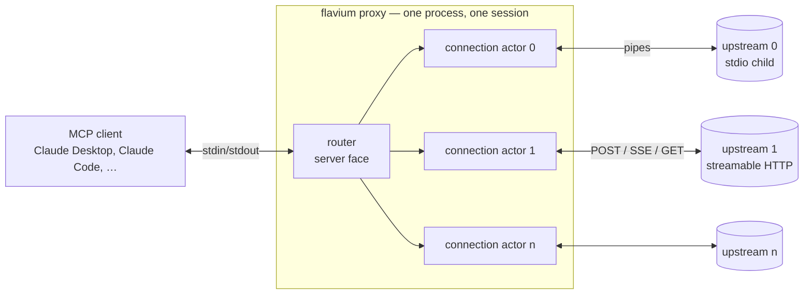

M2's job was to be a correct, bounded, fail-closed middlebox in front of
real clients. M5 put the gate in that path: between routing a call and
forwarding it, an `Authorizer` answers, and the answer — allow or deny —
is a trace event before anything else happens. The crate still does not
know Cedar exists; it holds two `flavium-core` traits and the CLI decides
what is behind them (§10). Budgets (T2), delegation (T3) and the
hash-chained recorder (T4) are still ahead.

## 2. Module map

Modules are listed bottom-up. Each layer depends only on layers above
it in this table (i.e. lower in the stack), never the reverse.

| Layer | Module | One line |
|---|---|---|
| Wire boundary | `framing` | `\n`-delimited frame reader/writer with a hard per-frame byte cap. Never looks inside a frame. Designated fuzz seam (T5). |
| | `sse` | Sans-I/O incremental Server-Sent Events parser with a per-event cap; refuses invalid UTF-8 rather than repairing it. Designated fuzz seam. |
| | `envelope` | Classifies one frame as request / notification / response; validates `jsonrpc`, ids, and shape; leaves `params`/`result`/`error` as `RawValue` borrows of the frame. Rejects batches. |
| | `splice` | Rewrites exactly one member's value inside a JSON object while preserving every other member's bytes and order. Rejects duplicate members. |
| | `builder` | Constructs the frames the proxy originates (results, errors, its own requests/notifications) and the fixed error-code table. |
| | `protocol` | Version policy: what the proxy offers (`2025-11-25`) and accepts (`2025-06-18`, `2025-11-25`), and its `serverInfo`/`clientInfo` name. |
| Transports | `transport` | The `Transport` enum (stdio or HTTP) with a uniform send/recv/close surface and a shared failure taxonomy; the `StdioTransport` implementation and its writer task; `normalize_newlines`. |
| | `http` | The streamable-HTTP client: one POST per frame, JSON or SSE response bodies, `MCP-Session-Id`, the optional GET listening stream, DELETE at close. |
| Protocol, per upstream | `idmap` | `PendingMap` (one per upstream: minted id → what is waiting) and `ClientTable` (one per session: client id → `InFlight { upstream, tool, call_id }`). All id translation lives here. |
| | `connection` | `connect()` runs the upstream handshake and spawns the connection **actor**, which owns one transport and one `PendingMap` and speaks `Command`/`Event` with the router. |
| | `toolset` | `ListPage` parsing and the merged, collision-checked `ToolSet` (name → upstream, plus each tool's raw bytes); `merged_result` takes the granted-name predicate. |
| Enforcement | `normalize` | The two-flavor path normalizer (POSIX / Windows). Pure, total, byte level, no I/O — fuzz-ready like the parsers above it. |
| | `args` | `tools/call` params → `flavium_core::ToolCall`. Hand-written visitor: a non-object `arguments` or a duplicate key is refused rather than resolved. |
| | `enforcement` | The bundle `router::run` takes: principal (from the envelope), `Authorizer`, `TraceSink`, `Clock`, and the `(tool, argument) → PathFlavor` map. All `flavium-core` traits — the crate never names an engine. |
| Session | `router` | The proxy's server face: startup (connect + list every upstream), the serve loop, client-face phase machine, the `tools/call` gate and `tools/list` filter, every trace emission, re-lists, teardown, `SessionSummary`. |
| Wiring | `config` | Transport-agnostic `UpstreamSpec`/`TransportSpec` and structural validation; `redact_url`. |
| | `stdio` | Production entry point `serve()`: builds transports from specs and runs the router over this process's stdin/stdout. |
| | `lib` | Re-exports; `#![forbid(unsafe_code)]`. |

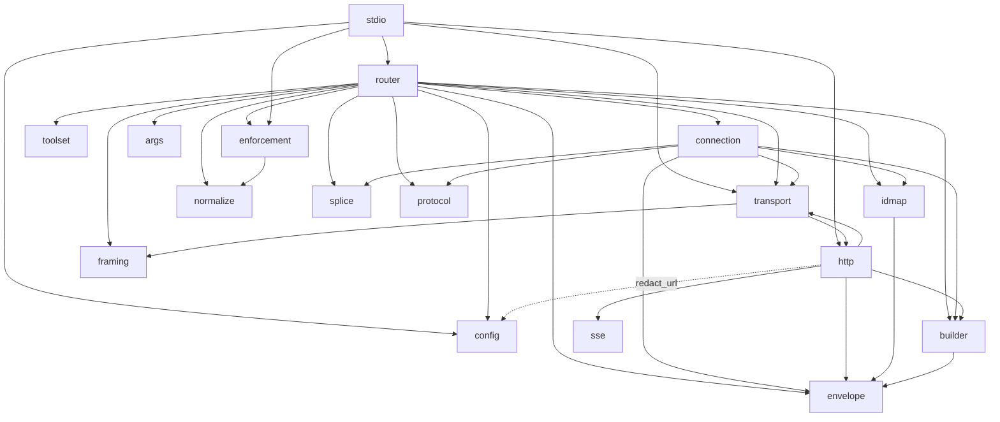

(`toolset`, `framing`, `sse`, `envelope`, `splice`, `protocol`,
`config`, `normalize`, and `args` depend on nothing else in the crate.
`args` and `enforcement` are the only modules that name `flavium-core`
types besides `router` and `idmap`.)

(`transport` and `http` reference each other: `transport` wraps
`HttpTransport` in its enum; `http` uses `transport`'s shared error and
`Received`/`DropReason` types and `normalize_newlines`. They form one
layer.)

## 3. Task and channel model

One session is one call to `router::run`. Everything else is tasks it
spawns or that its actors spawn. All queues are bounded `tokio::mpsc`
channels of capacity 64.

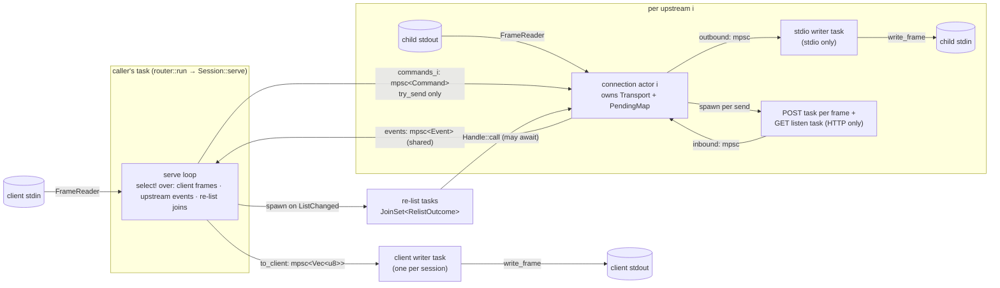

Tasks, in the order they come to exist:

| Task | Spawned by | Owns | Ends when |
|---|---|---|---|
| **Connection actor** (one per upstream) | `connection::connect`, after the handshake succeeded on the caller's task | the `Transport`, the `PendingMap`, progress-token scope tables, one clone of the events sender | `Command::Shutdown`, its command channel closing, its transport ending/failing (then it emits `Event::Ended`/`Fatal`), or the router's event receiver being gone |
| **Stdio writer** (one per stdio upstream) | `StdioTransport::from_streams` | the child's stdin | outbound channel closes (shutdown) or a write fails/stalls past 30 s |
| **HTTP POST task** (one per sent frame) | `HttpTransport::send` | one in-flight request | the response body (JSON or SSE) is fully read, or the POST fails |
| **HTTP GET listener** (≤ 1 per HTTP upstream) | `HttpTransport::start_listening` after `initialized` | the long-lived server→client stream | 405 (server offers no stream), session expiry, or `close()` |
| **Client writer** (one per session) | `router::run`, once startup succeeded | the client-side `AsyncWrite` | the `to_client` channel closes, or a write fails (it then drains and counts the rest as undelivered) |
| **Re-list task** (transient) | `Session::schedule_relist` on `Event::ListChanged` | a `Handle` clone | its `tools/list` drain completes or fails |

Three rules keep this graph deadlock-free and bounded:

1. **The serve loop never awaits an actor's command queue.** It uses
   `Handle::try_send` only. An actor may be parked on `events.send`
   (its queue toward the router is full) while the router is parked on
   `commands.send` (the actor's queue is full) — that is a cycle. So a
   full actor queue answers the client `-32603 upstream busy` instead
   of waiting. `Handle::send`/`Handle::call` (which *do* await) are
   only used from independent tasks: startup and re-lists.
2. **Every client-bound frame funnels through the one writer task**,
   so frames never interleave mid-write and the serve loop never
   blocks on the client's stdout.
3. **Writes to a child never run on the actor's task.** The stdio
   writer task owns the child's stdin behind a bounded queue and a
   30 s stall deadline; the actor keeps draining the child's stdout
   while a write is pending, so a child that stops reading its stdin
   with full OS pipe buffers cannot wedge the session — it trips the
   deadline and fails loudly.

The events channel is shared: every actor holds a clone of the sender.
Each live actor reports its own end before dropping its sender, so if
the router ever sees the channel closed *without* such a report, an
actor died silently — surfaced as `SessionEnd::Internal`, a bug
signal, rather than a hang.

## 4. Key types and who owns what

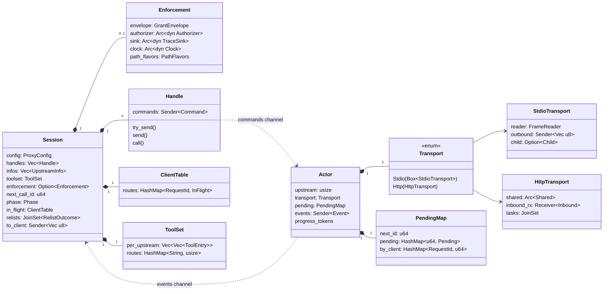

| Type | Module | Owned by | Role |
|---|---|---|---|
| `Session` (private) | `router` | the caller's task | All per-session state on the server face. Single-threaded by construction — only the serve loop touches it. |
| `Handle` | `connection` | `Session` (one per upstream); cloned into re-list tasks | The router's only way to talk to an actor. `try_send` for the serve loop; `send`/`call` for independent tasks. |
| `Actor` (private) | `connection` | its own task | Owns one upstream end-to-end: transport, minted-id space, progress-token scope. Translates ids both ways so the router never sees an upstream id. |
| `Transport` | `transport` | one `Actor` (or `connect()` during the handshake) | Uniform frame-in/frame-out over stdio or HTTP. Knows nothing about JSON-RPC except what HTTP forces on it (`SendContext`). |
| `PendingMap<T>` | `idmap` | one `Actor` | Minted id → `Pending::Client{client_id, client_id_raw}` or `Pending::Internal(reply)`. Cancel *removes* the mapping, which is what makes late responses drop. |
| `ClientTable` | `idmap` | `Session` | Client id → `InFlight { upstream, tool, call_id }` for requests in flight, session-wide. Rejects a duplicate in-flight id; lets the router drop a response from the wrong upstream; carries the `CallId` so a completion can name the decision it closes. `drain()` at teardown yields the open calls in `CallId` order. |
| `ToolSet` | `toolset` | `Session` (rebuilt whole on re-list) | Name → upstream index, plus each tool's raw bytes in upstream order. `build` fails on any duplicate name. `merged_result(keep)` is the client's unpaginated `tools/list` result, restricted by the granted-name predicate, plus how many survived. |
| `Enforcement` | `enforcement` | `Session` (as `Option`) | The grant gate: the envelope (and through it the principal), an `Authorizer`, a `TraceSink`, a `Clock`, and the path-flavor map. `None` is `--unenforced`. Built by the CLI; never constructed here. |
| `Clock` | `enforcement` | `Enforcement` | Where `now` comes from — `SystemClock` in production, something settable in tests. It lives on this side of the seam because `flavium-core` is clock-free by rule: a decision takes `now` as an argument, which is what makes it replayable. |
| `Command` / `Event` | `connection` | — | The only vocabulary between router and actor. `Command`: `Forward`, `Cancel`, `Request` (proxy-internal), `Shutdown`. `Event`: `Response` (carrying the `CallOutcome` only the actor can see), `Notification`, `ListChanged`, `Ended`, `Fatal`. |
| `SessionSummary` / `SessionEnd` | `router` | returned by `run` | End-of-session accounting: why it ended, per-direction frame counters, rejected/discarded counts. `clean_shutdown()` = client EOF with everything delivered. `SessionEnd::TraceFailed` is M5's addition: the sink refused an event. |

## 5. Session lifecycle

`router::run` has three phases, then teardown. The client is not read
from at all until every upstream is up and its tools are known — a
collision is refused at startup, never discovered mid-session.

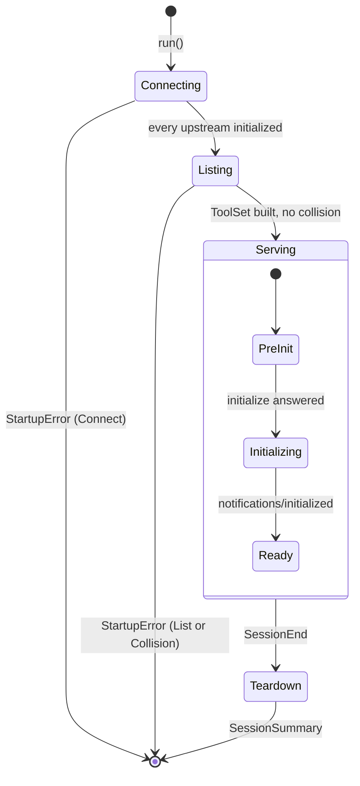

Client-face phases gate what the router will do (`Session::on_client_request`):

| Phase | `ping` | `initialize` | anything else |
|---|---|---|---|
| `PreInit` | `{}` | answered → `Initializing` | `-32002 Server not initialized` |
| `Initializing` | `{}` | `-32600 Already initialized` | `-32002` |
| `Ready` | `{}` | `-32600` | `tools/list`, `tools/call` handled; other methods `-32601` |

Upstream-originated notifications are dropped until the client face is
`Ready`; a re-list that completes before `Ready` sets
`pending_list_changed`, and one `notifications/tools/list_changed` is
flushed at the transition.

Teardown (the tail of `run`), in order: `try_send(Command::Shutdown)`
to every actor → abort re-list tasks → drop the router's `Handle`s
(closing every command channel — the fallback shutdown signal for an
actor whose queue was full) → join each actor with `shutdown_grace`,
aborting stragglers → drop `to_client` → join the writer with the same
grace, aborting it if the client stopped reading. Each actor's own
teardown fails its internal callers with `CallError::Closed`, emits its
end event, and closes its transport (stdio: close stdin, wait 5 s, kill;
HTTP: abort tasks, best-effort `DELETE`).

## 6. Flows

Participants used below: **Client**, **Router** (the serve loop / `Session`),
**Writer** (client writer task), **Actor i**, **Transport i**, **Upstream i**.

### 6.1 Startup: connect and list every upstream

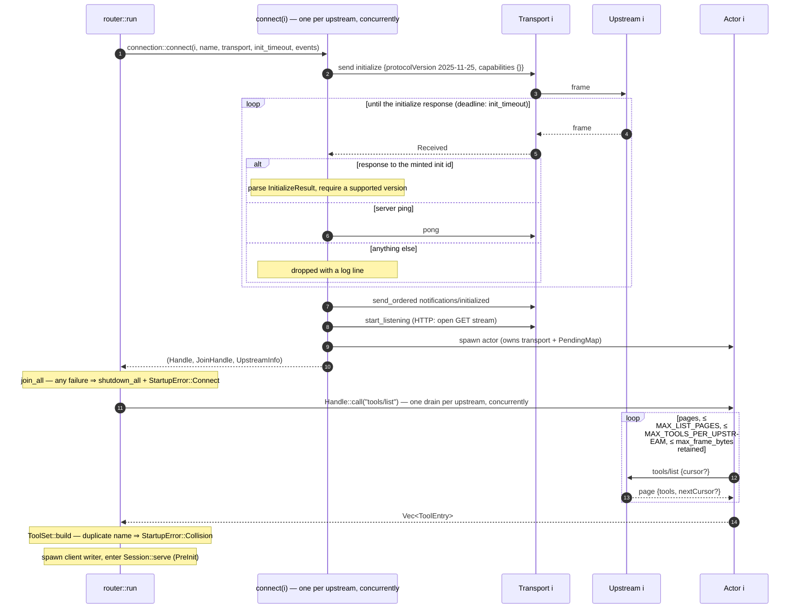

Details worth knowing: the handshake declares **no** client
capabilities upstream (no roots, sampling, elicitation) — the
server→client request channel is closed on purpose; `initialized` is
sent with `send_ordered` because over HTTP a detached POST could race
the next request; an upstream that declares no `tools` capability
contributes an empty list and a warning, not a failure.

### 6.2 Client handshake and `tools/list`

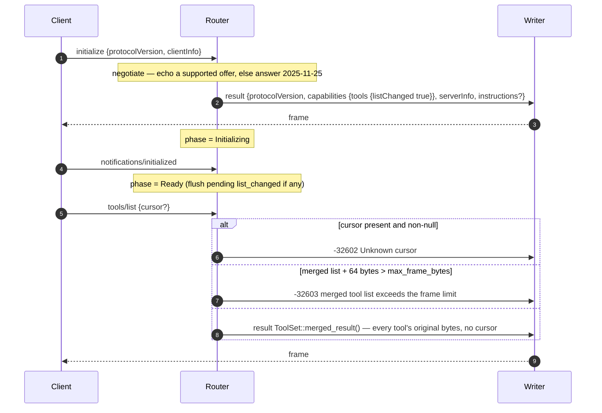

`tools/list` never touches an upstream: the table was drained at
startup and is refreshed only by `list_changed` (§6.5). The proxy never
mints a cursor, so any cursor is foreign by definition. `instructions`
is the single upstream's text verbatim, or `## name` sections when
several upstreams supply one.

### 6.3 `tools/call`: routing and id translation

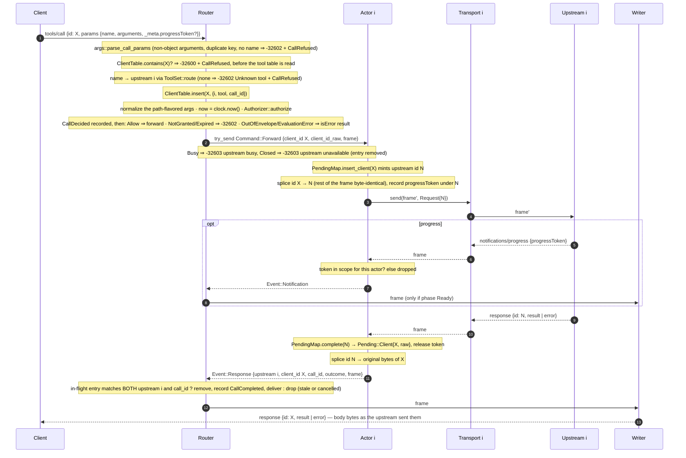

The gate's order is forced by what each step needs. **Duplicate ids
before routing**, because otherwise the two refusals differ by code —
`-32600` for a name the upstreams offer, `-32602` for one they do not —
and that difference is an oracle for exactly the set the filtered
`tools/list` exists to hide. **Routing next**, because a granted tool no
upstream serves must not produce an `Allow` for a call that then cannot
happen — a trace saying a tool was used when it was not. **Claiming the
id before deciding**, so a duplicate can never produce an `Allow`
followed by a refusal for the same `CallId`: one call, one terminal
event. **Deciding last**, so the denial is the last word.

The decision is made on the *normalized* arguments while the client's own
bytes are what cross to the upstream, and the trace records the
normalized form — the form the decision was actually about. Every allowed
call gets exactly one `CallCompleted`, including the ones that never come
back: not forwarded (queue full, actor gone, untranslatable), cancelled,
or abandoned when the session ends with the call in flight.

Three independent checks bound a response's blast radius: the actor only
completes ids *it* minted (`PendingMap`); the router only delivers a
response whose client id is still in flight *toward that upstream*; and
the in-flight entry must be *the same call*, matched by `CallId`, not
merely the same id slot. The third is what the first two miss on their
own: a client may legitimately reuse a request id once its call is
cancelled, and if the new call goes to the same upstream, the old call's
queued response would otherwise be delivered under the new call's id and
recorded as the new call's outcome — a `CallCompleted` naming the wrong
call, in the artifact that exists to answer "what did this agent
actually do?". Progress notifications get their own scoping through the
recorded `progressToken`.

If the frame parses at the envelope boundary but resists an unambiguous
rewrite (duplicate members), the actor fails closed: it never reaches
the upstream and the client gets `-32600 Invalid Request`. If an
upstream *response* resists rewrite, the client still gets a typed
answer (`-32603 upstream response could not be translated`) rather than
a hang.

### 6.4 Cancellation and late responses

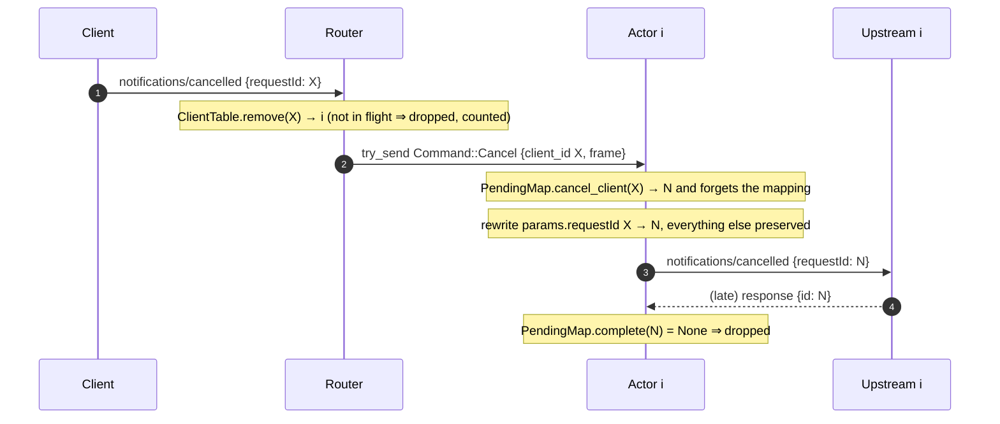

Cancellation is best-effort by specification. If the actor's queue is
full the cancel is not forwarded — but the router already removed the
in-flight entry, so the eventual response is dropped by the route check
in §6.3 instead. Either way the client never sees a response to a
request it cancelled.

### 6.5 `list_changed` and re-listing

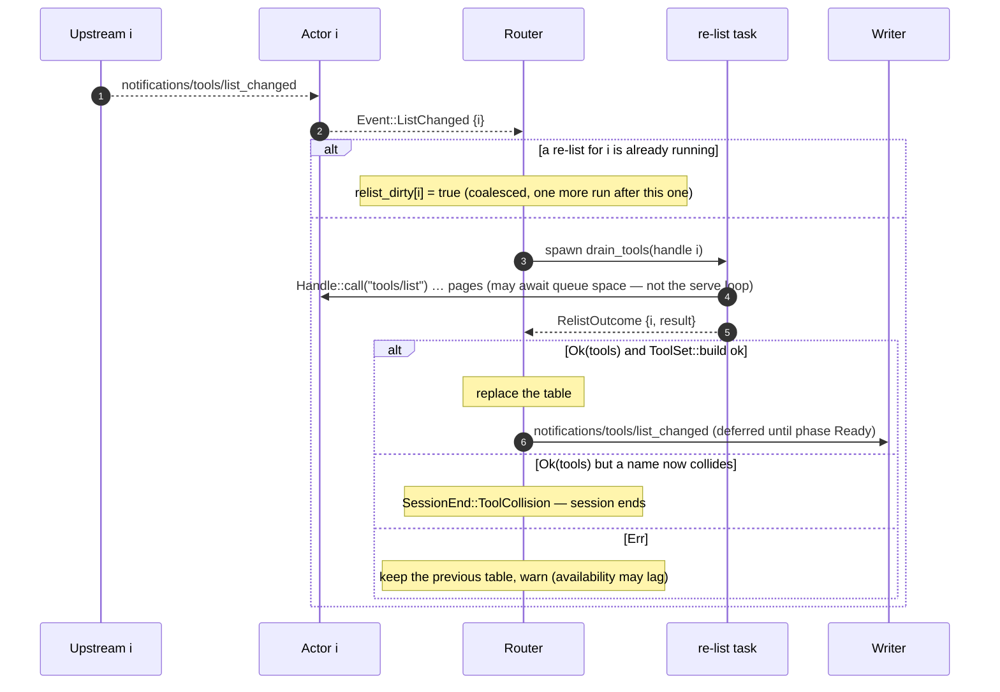

Why a failed re-list is tolerated but a collision is not: a stale table
only affects *availability* — grants gate every call regardless of what
the table says — whereas a name that routes to two upstreams is
ambiguous authority, and the proxy refuses to serve ambiguity.

### 6.6 Shutdown and failure propagation

Every ending funnels into one `SessionEnd`, and every ending — clean or
not — runs the same teardown (§5).

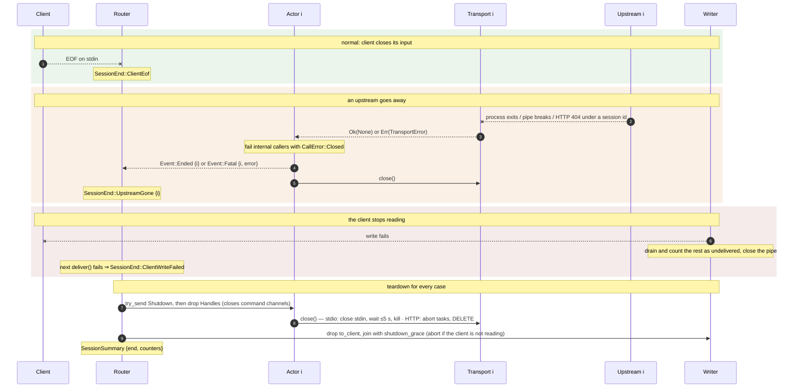

The policy behind the middle case is stated in `router.rs`: until
supervision lands (T3), *any* upstream ending ends the whole session,
because dying loudly beats serving a session whose tool surface
silently shrank. Whether the exit code is success is decided by
`SessionSummary::clean_shutdown()` — client EOF *and* every accepted
frame delivered.

### 6.7 Streamable HTTP, one request

The HTTP transport turns each outbound frame into its own POST and
reassembles the upstream's side of the conversation from response
bodies and the optional GET stream. The actor above it sees the same
`send`/`recv` surface as for stdio.

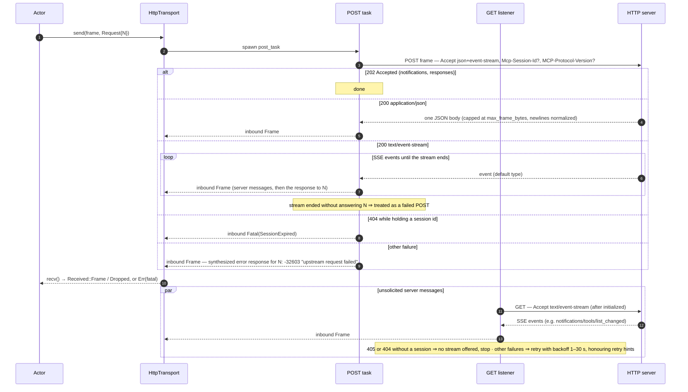

Design points: a failed POST is a *per-request* failure — hosted
endpoints blip — so the transport synthesizes a JSON-RPC error
*response* for that id, and the actor's `PendingMap` accounting
resolves normally; the synthesized error is the only frame this
transport ever originates. Session expiry (404 under a session id) is
the one HTTP condition treated as fatal, because silently
re-initializing would put the upstream in a state the client never
observed. Redirects are refused; SSE resumability (`Last-Event-ID`) is
deliberately not implemented in M2. Header values are marked sensitive
and URLs are redacted before they can reach a log.

## 7. Invariants

What the code is written to guarantee, and where each guarantee lives.
A reviewer checking a change should be able to say which of these it
touches.

| # | Invariant | Where it is enforced |
|---|---|---|
| I1 | **Bodies are byte-faithful.** `params`, `result`, and `error` are never re-serialized in either direction; what is forwarded is the original frame with exactly one member rewritten (`id`, or `params.requestId` for a cancel). Member keys of a rewritten frame are re-encoded canonically and inter-member whitespace normalized — body-level identity is unaffected. | `envelope` (borrows `RawValue`s, never re-encodes), `splice::rewrite_member`, `toolset` (tool objects kept as raw bytes) |
| I2 | **Fail closed at every parse boundary.** A frame that is not one well-formed JSON-RPC 2.0 object is a typed error and is never forwarded: batches, non-objects, bad `jsonrpc`, non-integer/string ids, ambiguous shapes, duplicate members, oversized frames, invalid UTF-8, raw newlines inside JSON strings. | `framing`, `sse`, `envelope`, `splice`, `transport::normalize_newlines` |
| I3 | **Id containment.** A client id never reaches an upstream; an upstream id never reaches the client. Each upstream is spoken to in a monotonic id space the proxy mints. A response is delivered only if (a) the actor minted its id and it is still pending, (b) the router still has the client id in flight toward *that* upstream, and (c) the in-flight entry is the *same call* (`CallId`), not a later one that reused the id. Progress notifications are delivered only for tokens the same actor forwarded. | `idmap::PendingMap`, `idmap::ClientTable`, `connection::Actor` (progress scope), `router::on_upstream_event` |
| I4 | **Cancellation removes the mapping.** Late responses after a cancel are dropped as a consequence of the map, not by a timer. | `PendingMap::cancel_client`, `ClientTable::remove` |
| I5 | **Capabilities are attenuated on both faces.** The client is told exactly what the proxy honors (`tools.listChanged`); upstreams are told the proxy has no client capabilities, so server→client requests are refused (`ping` answered as a courtesy) and notifications outside `tools` are dropped. | `router::on_initialize`, `connection::initialize`, `Actor::handle_upstream_frame` |
| I6 | **No ambiguous routing.** A tool name offered twice — across upstreams or within one — is refused at startup and on re-list; the proxy never picks a winner silently. | `ToolSet::build`, `router::startup`, `Session::on_relist` |
| I7 | **Bounded memory.** Per-frame cap in both directions and on every transport (16 MiB default); per-event cap in SSE; per-upstream tool table bounded by pages, count, and bytes; every queue bounded at 64. | `framing`, `sse`, `router::drain_tools`, channel constructors |
| I8 | **No deadlock through queues or pipes.** The serve loop never awaits an actor queue; child stdin is written by its own task with a stall deadline; each HTTP POST is its own task. | §3 rules 1–3 |
| I9 | **Secrets never reach logs.** Header values are `sensitive`; URLs are redacted to scheme/host/port/path; `TransportSpec`'s `Debug` redacts; HTTP failure reasons are scrubbed of URLs. | `http`, `config::redact_url`, `config::TransportSpec` |
| I10 | **Loud failure.** Any upstream ending ends the session with a typed `SessionEnd`; a task dying without reporting surfaces as `Internal`, not a hang; internal callers of a dead actor get `CallError::Closed`. | `router::serve`, `Actor::run` teardown |
| I11 | **Every frame is accounted for.** Frames forwarded, delivered, undelivered, rejected at the parse boundary, and discarded by the router are counted in `SessionSummary` **and**, when the session is enforced, emitted as `FrameRejected` / `FrameDiscarded` trace events. The two `DiscardKind`s an upstream *connection* owns (`UnknownResponseId`, `OutOfScopeProgress`) stay unrecorded in T1: only the serve loop traces. | `router` counters, `WriterCounters`, `Session::record` |
| I12 | **No `unsafe`, no panics on the request path.** `#![forbid(unsafe_code)]`; workspace clippy lints flag `unwrap`/`expect` (warn, promoted to errors by `-D warnings` in the CI gate; test modules opt out explicitly); every failure is a typed error. | `lib.rs`, workspace `Cargo.toml` `[workspace.lints]` |
| I13 | **No authority without a grant** (**W1**). When enforcement is configured, the only path from a client `tools/call` to `Command::Forward` runs through a `Decision::Allow`. Every other outcome removes the in-flight entry and answers the client itself. | `Session::on_tools_call`, `Session::decide_call` |
| I14 | **Visibility ⊆ authority** (**W2**). Every tool in a `tools/list` result has a live grant at the `now` used — core's INV-3/INV-1b, at the wire. Constraints do not filter: whether a call is inside the envelope depends on arguments that do not exist at list time. | `Session::on_tools_list`, `ToolSet::merged_result` |
| I15 | **Fail closed on audit** (**W3**). After a `TraceSink::record` error no further client frame is answered; the session ends `TraceFailed` and the process exits non-zero. A full disk stops the agent rather than running it unrecorded. | `Session::record`, `record_to`, `run` teardown |
| I16 | **The bytes are the client's** (**W5**). Path normalization changes the decision and the trace, never the forwarded frame — I1 is unaffected by enforcement. | `Session::evaluated_call` (works on a clone), `Command::Forward` |
| I17 | **Absence and denial are indistinguishable** (**W6**). The reply to a call on an ungranted or expired tool is byte-identical to the reply for a tool no upstream offers; both come from one function. Every other refusal that could differentiate them is raised *before* the tool table is read, so it cannot become an oracle either. | `router::unknown_tool_frame`, the duplicate-id check ahead of `ToolSet::route` |
| I18 | **Normalization never widens.** A grant's path prefix comes out no broader than its author wrote it: a trailing separator survives, a prefix that reduces to nothing is refused rather than compiled to the everything-prefix, and a leading `//` root stays distinct from a single `/`. | `normalize::normalize_prefix`, `grants::ArgEntry::compile` |

## 8. Client-visible error surface

All proxy-originated errors are built in `builder` from the fixed code
table. Ids echo the request's original bytes; `null` when the id could
not be read.

| Code | Meaning here | Raised when |
|---|---|---|
| `-32700` Parse error | frame unreadable | oversized client frame; invalid UTF-8; invalid JSON |
| `-32600` Invalid Request | readable, illegal | not a JSON-RPC 2.0 object (batch, bad shape, bad id); `initialize` after init; a client id already in flight; a request that resists id rewrite |
| `-32601` Method not found | outside advertised capabilities | any method other than `ping`/`initialize`/`tools/list`/`tools/call` once `Ready` |
| `-32602` Invalid params | | malformed `initialize` params; a `tools/list` cursor (the proxy never mints one); `tools/call` params that are not an object, carry a duplicate key, or have no string `name`; **a tool no upstream offers, and a tool no live grant names** — deliberately the same bytes, so absence and denial are indistinguishable |
| `-32603` Internal error | | actor queue full (`upstream busy`); actor gone (`upstream unavailable`); merged tool list would exceed the frame cap; upstream response untranslatable; HTTP POST failed for that request (`upstream request failed`, synthesized by the transport) |
| `-32002` Server not initialized | | any non-`ping`, non-`initialize` request before the client handshake completes |

One denial is deliberately **not** a JSON-RPC error: a call on a tool the
agent holds whose arguments fall outside the envelope (or that the engine
could not evaluate) is answered with a successful response carrying a
tool error — `isError: true`, `"denied by policy"`. That is MCP's way of
saying "the tool refused" rather than "the request was malformed", and it
is the shape an agent can act on: it named a tool it has and may retry
inside the envelope. It carries nothing about what the envelope is.
Answering `-32603` for an evaluation error instead would tell the agent
the failure is not its fault, which invites a retry loop; the detail goes
to the trace and the operator's log.

Everything else the client sees is an upstream's own response, bytes
intact.

## 9. Limits and tuning knobs

| Knob | Default | Where | Purpose |
|---|---|---|---|
| `ProxyConfig::max_frame_bytes` | 16 MiB | `framing::DEFAULT_MAX_FRAME_BYTES` | Per-frame cap, all transports, both directions; also the per-upstream tool-table byte budget and the SSE per-event cap. |
| `ProxyConfig::shutdown_grace` | 5 s | `router` | How long actors and the writer get to finish at teardown before being aborted. |
| `ProxyConfig::init_timeout` | 60 s | `router` → `connection::connect` | Per-upstream `initialize` deadline (generous: `npx …` with a cold cache). |
| `ProxyConfig::list_timeout` | 30 s | `router::drain_tools` | Per-page `tools/list` deadline. |
| `CLIENT_QUEUE_FRAMES`, `COMMAND_QUEUE`, `OUTBOUND_QUEUE`, `INBOUND_QUEUE` | 64 | `router`, `connection`, `transport`, `http` | Every bounded channel. |
| `MAX_LIST_PAGES` / `MAX_TOOLS_PER_UPSTREAM` | 1 000 / 10 000 | `toolset` | Pagination and count caps per upstream. |
| `CHILD_EXIT_GRACE` | 5 s | `transport` | Wait after closing a child's stdin before killing it. |
| `WRITE_STALL_TIMEOUT` | 30 s | `transport` | One frame write to a child may stall this long before the pipe is declared dead. |
| `CONNECT_TIMEOUT` / `DELETE_TIMEOUT` | 10 s / 2 s | `http` | HTTP connect budget; best-effort session DELETE budget. |
| `RECONNECT_MIN` … `RECONNECT_MAX` | 1 s … 30 s | `http` | GET-stream reconnect backoff bounds (SSE `retry` hints clamped into this range). |
| `OFFERED_VERSION` / `SUPPORTED_VERSIONS` | `2025-11-25` / `2025-06-18`, `2025-11-25` | `protocol` | Version policy, both faces. Batching-era revisions are excluded on purpose. |

Only `ProxyConfig` is runtime-configurable today; the CLI passes
`ProxyConfig::default()`.

## 10. Where enforcement plugs in

Landed in M5. What follows is where each piece lives, not a forecast.

Both crates named below have their own architecture document —
[core-and-policy.md](core-and-policy.md) — covering the grant model, the
reference semantics, attenuation, the trace catalog, and the compilation
into Cedar. What follows is only the seam.

- **The vocabulary (M3, `flavium-core`).** `GrantEnvelope` (principal +
  grants), `Grant`/`Constraint`/`ArgValue`, `ToolCall`,
  `Decision`/`DenialReason`, the reference `decide`, `attenuates`, and
  two traits with no I/O: `Authorizer` (`authorize(principal, call, now)
  -> Decision`, `granted_tools(principal, now)`) and `TraceSink`
  (`record(&TraceEvent) -> Result`). **This crate depends on
  `flavium-core` and on nothing else new** — `flavium-core` has no
  dependencies of its own, so `cargo tree -p flavium-proxy-mcp` still
  contains no `cedar-policy`. The Cedar engine (M4,
  `flavium-policy::CedarAuthorizer`) implements `Authorizer`; the CLI is
  the only place that names it.
- **The seam: `Enforcement`.** `router::run` takes
  `Option<Enforcement>`. `Some` is the enforced proxy; `None` is
  `flavium proxy --unenforced`, the transparent middlebox that forwards
  everything and records nothing — an empty envelope in the audit record
  for a session that allowed everything would be a false statement.
  The dividend of the trait-only seam is immediate: the proxy's own
  tests use `GrantEnvelope`, the *reference* implementation, as their
  authorizer, so they test wiring against the specification, while the
  CLI's end-to-end tests exercise the real engine.
- **`tools/call` authorization** — `Session::on_tools_call`, between
  `ToolSet::route` and `Command::Forward`. `args::parse_call_params`
  turns `name` + `arguments` into a `ToolCall` (strings and `i64`
  integers as themselves, everything else `ArgValue::Other`; a
  non-object `arguments`, a duplicate key, or a missing `name` ⇒
  `-32602` + `CallRefused`), path-flavored arguments are normalized,
  `now` is read once from the `Clock`, and the `Authorizer` answers.
  See §6.3 for the order and why it is forced.
- **`tools/list` filtering** — `Session::on_tools_list` projects
  `ToolSet` through `Authorizer::granted_tools(principal, now)` (I14).
  An expired grant makes the tool vanish from the list *and* makes its
  calls answer `-32602`: one fact with two faces.
- **Path normalization** — `normalize`, opt in per `(tool, argument)`
  through the grant file's `path-prefix` / `windows-path-prefix`, with
  the flavor declared rather than guessed. Without it,
  `Prefix("/data/invoices/")` allows
  `read_file("/data/invoices/../../etc/passwd")` — a byte prefix match
  whose resource is `/etc/passwd`. The flavor cannot be inferred from
  the proxy's host: an HTTP upstream is another machine, and a stdio
  child can be in WSL or a container.
- **Trace events** — emitted **only** from the serve loop, one task, in
  causal order, so a sink can assign sequence numbers or chain hashes
  under its own lock without one. Connection actors emit none; what only
  an actor knows (whether a result carried `isError`, which error code
  the client will see, that a frame resisted rewriting) rides to the
  router inside `Event::Response` as a `CallOutcome`. A sink failure ends
  the session (I15), with a proxy-side `SessionEnd::TraceFailed` for the
  exit path and a final best-effort `SessionEnded { Internal }` for the
  record — the trace's vocabulary gains nothing from a variant describing
  the event a broken sink cannot write, and adding one would mean editing
  the verification target.
- **Principal.** Static per proxy process, from the config file's
  `principal`, and read from the envelope so the identity that authorizes
  and the identity the trace names cannot drift apart. `clientInfo` is
  untrusted data and never identity (it is recorded in
  `HandshakeCompleted` as data).
- **Cost, accepted:** `TraceSink::record` is synchronous I/O on the serve
  loop. For a local append that is microseconds; if T4's recorder makes
  it more, it moves to its own task and this decision is revisited there.
- **Deliberately deferred beyond T1:** upstream supervision and restart
  policies (T3 — today any upstream ending ends the session); tool
  namespacing (`server.tool`) as the collision fallback; an HTTP *server*
  face; SSE resumability; the 2026-07-28 protocol revision; budgets (T2);
  the hash-chained recorder, replay, and the published trace spec (T4);
  the fuzz harness over `framing`/`sse`/`envelope`/`splice` — and now
  `normalize` and `args`, both written pure and total for it (T5).

## 11. Tests as executable specification

| Where | What it pins |
|---|---|
| `tests/router_session.rs` (22 tests) | The M2 contract end to end over in-memory pipes with two scripted upstreams: proxy-answered `initialize`, per-upstream handshakes, merged and drained `tools/list`, routing by name with ids translated both ways, cancellation and late-response drops, collisions, `list_changed` re-lists, phase gating, and the T1 acceptance criterion that `params`/`result` bytes round-trip identically. Since M5 every one of these sessions runs **through the gate** on a permissive envelope, assertions unchanged — which is what makes the suite the regression net for I16. |
| `tests/enforcement_gate.rs` (13 tests) | What the gate decides, at the wire. The per-axis denial table (path outside prefix including `../` and `..\`, off-pattern recipient, out-of-range and wrong-typed and unrepresentable numbers, `Absent` violated, expired grant, ungranted tool), each asserting three things: the upstream never saw the call, the exact client bytes, and the trace event. Plus: the allowed normalized paths; I16 byte identity; the filtered list moving as a grant expires over a settable clock; duplicate keys refused; `EvaluationError` through a stub `Authorizer` (unreachable from a grant file by construction); a sink failure ending the session (I15); a full causal transcript; cancelled and abandoned completions; and the unenforced path. |
| `tests/http_upstream.rs` (3 tests) | The streamable-HTTP transport against a real in-process axum server: session id assigned at `initialize` and required afterwards, protocol-version header, 202 for notifications, JSON and SSE bodies (multi-line data exercising newline normalization), the GET stream, DELETE at close, 404 after expiry. |
| `crates/flavium-cli/tests/proxy_e2e.rs` (11 tests) | The real binary over real child processes (`examples/scripted_upstream`), with the **real Cedar engine** and a real trace file on disk: config-file and `--unenforced -- command` forms, multi-upstream merge, collision refusal, exit codes — and the enforcement path end to end (filtered list, allow, out-of-envelope denial, traversal denial, ungranted tool, the JSONL transcript), a grant-less config refusing to start, and `--unenforced` refusing `--trace`. |
| Unit tests in each module | The parser boundaries (`framing`, `sse`, `envelope`, `splice`) — including the failing paths: oversized, invalid UTF-8, `id: null`, duplicate members, batches; `normalize`'s two-flavor table and the two false allows it exists to close; `args`'s classification table and its duplicate-key refusal (paired with the assertion that a plain `BTreeMap` would silently take the second value); `idmap` translation and cancel semantics; `toolset` merge/collision/filter; `builder` escaping; `protocol` version policy; `http` setup redaction. |
| `crates/flavium-cli` unit tests | The grant loader's refusal and warning tables (`grants.rs`), including every `version` row and eight reference instants for the expiry conversion; the JSONL sink's encodings, its truncation boundary, and the SHA-256 vectors (`trace.rs`); the flag combinations that refuse (`main.rs`). |
| `examples/scripted_upstream.rs` | A minimal stdio MCP server (one tool, name from argv) for the e2e tests and for driving the proxy by hand. |

The demo checklists in `docs/tasks/v0.1/` record what was verified
against real clients (Claude Desktop, Claude Code) at each milestone.

## 12. How the CLI uses the crate

`flavium proxy` (in `crates/flavium-cli`) reads one TOML file
(`--config`) holding both the upstreams and the grants, or — behind
`--unenforced` — takes a single stdio upstream from `-- command…`. It
then, in order:

1. **`grants.rs`** parses the file as one document (`deny_unknown_fields`
   throughout), checks `version` by exact match, and compiles each
   `[[grant]]` into a `flavium_core::Grant` plus the `(tool, argument) →
   PathFlavor` map. Everything ambiguous is a startup error while an
   operator is watching; a grant that can only ever deny is a warning.
   A file with no grants **refuses to start** unless `--unenforced` says
   so on purpose.
2. **`CedarAuthorizer::new`** compiles the envelope into a policy set.
   This is the only mention of Cedar in the workspace outside
   `flavium-policy`.
3. **`trace.rs`** opens the `--trace` file (`0600` on unix) if there is
   one, so a bad path fails now rather than mid-session; otherwise the
   sink is `NullSink`.
4. The four pieces plus `SystemClock` become an `Enforcement`, and
   `stdio::serve(ProxyConfig::default(), &specs, enforcement)` validates
   the specs, builds one `Transport` per upstream (spawning children,
   constructing HTTP clients — closing what it already built if a later
   one fails), and hands them to `router::run` over this process's
   stdin/stdout.

Logs go to stderr (`RUST_LOG`, default `info`); stdout carries only MCP
frames; spawned children inherit stderr. The exit code is success iff
`SessionSummary::clean_shutdown()`. The JSONL sink is hand-written so
that `flavium-core` stays serde-free — the verification target carries
the vocabulary and nothing else — and because `TraceEvent` is
deliberately not `#[non_exhaustive]`, a new variant is a compile error
here rather than a silently unserialized event. The operator-facing
reference — flags, config keys, grants, the trace file, exit codes,
startup errors, client wiring — is [docs/cli.md](../cli.md).
